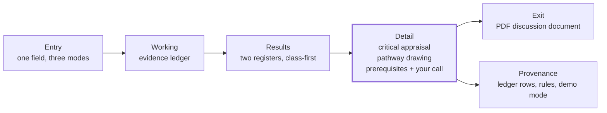

# Elute — PRD

**Working name:** Elute (a repurposing tool that always shows you the counterpoint)
**Track:** HackMIT 2026 · Regeneron Challenge ("Help Patients: Make Clinical Trials and Biostatistics Better")
**Date:** September 20, 2026 · **Status:** v2, mid-build (v1 was September 19, pre-build)
**Source vision:** [`user_journey.txt`](./user_journey.txt) — this document does not restate it; it decides what to do with it.
**Companion:** [`pitch.md`](./pitch.md) holds the story, the mentor's verbatim quotes, and audiences beyond our user. Nothing in it appears in the product.

**What changed in v2, after the second conversation with Henry Wei and the first build:**
1. One user. The product is built for the accountable scientist. The agent's thought process is a primary feature for that user, not a transparency add-on for IT; other audiences Henry named are pitch context (§3).
1a. The falsifiable claim section (v1 §3) is removed; its two-minute test survives as the Design exam in §11.
2. The results page is redesigned around how scientists actually triage, from a cited review of their frameworks and failure data (§4b, §7). Drug class and target class become prominent; two registers, tested and untested, each with a printed rule.
3. A pathway drawing joins Detail, with a stated visual grammar for recognising known biology versus the hypothesis without a caption (§7).
4. The exit is a shareable discussion document, designed to be unbiased (§7, §11).
5. *Evidence as of* is a demo mode, not a product control (§6, §13).
6. Google Co-Scientist is assessed as an upstream idea source our pipeline would check, not a competitor to imitate (§5).
7. Risks (§9) are unchanged and will be revised at the backend stage; their severities are v1 and some are stale (a live surface has since shipped).

**v2.2, later on Sept 20, after the second team review:** the landscape section moved to `pitch.md` and a pipeline direction took its place (§5); the entry line is reframed positively and spoken, not shown (§6); the results card becomes four questions in the scientist's order, disclosed as a stepper inside the row (§7); the registers are renamed in plain words; the ledger becomes an animated build-up; the prerequisites become a numbered walkthrough; the pathway is restyled for restraint; the export is a PowerPoint deck, not a PDF; the nilotinib case is built end to end before anything else (§8).

**Numbered principles** cited below (Principle 1 to 7) are the seven experience principles in `user_journey.txt`; §7 names the three that are the product.

---

## 1. One line

Build the tool that turns a skeptical scientist's *"prove it to me"* into *"now I can decide for myself"* — by always showing the reasoning, always showing the doubt, and never pretending to be more certain than it is.

---

## 2. The problem, as it actually happened

In July 2016, a Georgetown group published a pilot study of **nilotinib** — a leukemia drug — in twelve people with Parkinson's disease. Motor and cognitive scores improved. A dopamine metabolite rose in spinal fluid. The press coverage was enormous. ([Pagan et al., *J Parkinsons Dis* 2016](https://doi.org/10.3233/jpd-160867))

Imagine a translational scientist at a pharma company reading it that week. Their job is to decide whether this is worth pursuing. Their reputation rides on the call. What could they see, and what couldn't they?

What was *knowable* at the time, from public sources, before a single patient enrolled in the follow-up trial:

- **The pilot was open-label with no placebo arm** — the authors said so themselves. Twelve patients, all of whom knew they were on the drug.
- **Nilotinib barely enters the brain.** Two years earlier, a leukemia study had measured the CSF/plasma ratio at **0.53% (range 0.23–1.5%)**. ([Reinwald et al., *BioMed Res Int* 2014](https://pmc.ncbi.nlm.nih.gov/articles/PMC4082894/))
- **The biomarker had an alternative explanation.** Five months after the pilot, a peer commentary argued the dopamine-metabolite rise could be explained by patients being taken off their MAO-B inhibitors for the study — not by nilotinib at all. ([Schwarzschild, *J Parkinsons Dis* 2017; online Dec 2016](https://pmc.ncbi.nlm.nih.gov/articles/PMC5302030/))

The properly controlled trial — **NILO-PD**, 76 patients, 25 sites, double-blind, placebo-controlled — recruited from November 2017 to December 2018. It found no robust clinical effect, no change in the dopamine biomarkers, and CSF concentrations of a fraction of a percent of serum. ([Simuni et al., *JAMA Neurology* 2021](https://jamanetwork.com/journals/jamaneurology/fullarticle/2773698); [PK abstract](https://www.neurology.org/doi/10.1212/WNL.94.15_supplement.4418)) The Parkinson's Foundation's summary: people with Parkinson's [should pass on this drug](https://www.parkinson.org/blog/research/nilotinib).

Every counter-argument was public before the trial started. None of it was *organized*. That is the bottleneck.

**The problem is not generating repurposing hypotheses.** AI now produces them by the hundred. The problem is that the accountable human can't see *why* a candidate is believed, *what would make it wrong*, or whether it rests on decades of evidence or one unblinded pilot. So the good hypotheses die in an inbox next to the bad ones, and the bad ones sometimes get a phase 2.

The person who wrote this challenge said it to us directly:

> *"It's not that I don't believe you. I don't understand what your rationale is."* — Henry Wei, MD, Regeneron, Sept 19, 2026

### The numbers behind it

- When Amgen scientists tried to reproduce 53 landmark preclinical cancer papers, they succeeded with **6**. ([Begley & Ellis, *Nature* 2012](https://www.nature.com/articles/483531a)) Bayer reported reproducing roughly **20–25%** of 67 published findings. (Prinz et al., *Nat Rev Drug Discov* 2011, [doi:10.1038/nrd3439-c1](https://doi.org/10.1038/nrd3439-c1))
- Regeneron's own origin story is a replication failure: published knockout-mouse phenotypes that didn't hold up when the company made the mice itself. The starter kit calls the resulting discipline *separating what people believe from what they actually know*. ([Regeneron starter sheet: scientific credibility of sources](./STARTER%20SHEETS%20from%20Regeneron/); Henry Wei, in conversation)
- A new chemical entity takes **13–15 years and $2–3B**; repurposing an approved drug can succeed at up to ~30% versus under 10% for de novo discovery — *if* the right candidates are chosen. ([Pushpakom et al., *Nat Rev Drug Discov* 2019](https://www.nature.com/articles/nrd.2018.168))
- It keeps happening. Exenatide: positive phase 2 in 2017 ([Athauda et al., *Lancet*](https://pubmed.ncbi.nlm.nih.gov/28781108/)), negative phase 3 in 2025, 194 patients, 96 weeks ([Vijiaratnam et al., *Lancet*](https://pubmed.ncbi.nlm.nih.gov/39919773/)).

---

## 3. Who it's for

**Primary — the accountable expert.** A translational scientist or physician-scientist in pharma. Deep domain expertise; time-poor; skeptical of AI by default; professionally on the hook for being wrong; not a command-line user. Knows more biology than the model. Doesn't want to be told what to believe — wants their own judgment amplified. (Full persona in `user_journey.txt`. Note: the judge of this challenge *is* this person.)

**What this user must be able to see: the agent's thought process.** This is a main function of the product, for the scientist, not a transparency feature for IT. The thought process the tool shows must:
- do the research on everything that matters to the scientist for this candidate, and show that it did, step by step, with what each step consulted and what came back;
- cover the edge cases for the specific drug and indication (exposure, compartment, class liabilities, prior attempts, the likely trial population), so nothing the scientist would check is missing;
- answer, inside the shown path, every "why did it decide that" a scientist would ask about a label, an ordering, or an objection, so no question needs to be asked of the tool.

Tool calls, packages and the dependency manifest still exist on Provenance for reproducibility, but they are not a highlighted function and never appear on a main surface.

**Not for this weekend.** Henry named investors, diligence teams, small biotechs, grant applicants, educators and patients as people who would want this. We are building for one user in 24 hours, and the product is not tailored to the others. Patients are the population he called the most delicate; leaving them out is our decision, and the tool must never read as advice. His words are in `pitch.md`.

**Job stories** (Intercom form — situation, motivation, outcome):

- *When* I'm handed an AI-generated repurposing candidate, *I want to* see why it might be wrong before why it might be right, *so I can* defend or kill it to a colleague in my own words.
- *When* a mechanistic chain has six links, *I want to* know which link is established and which is one mouse paper, *so I* don't stake a program on the weak one.
- *When* a drug looks efficacious, *I want* safety to be part of the argument, not a banner, *so I* see *why* it's downranked, not just that it was.
- *When* the tool labels a link or orders a list, *I want to* see the steps it took and the edge cases it checked, *so* every "why did it decide that" is already answered on the page.

---

## 4. What we heard (discovery)

**Interview 1 — Henry Wei, MD (Regeneron; ex-Google, Aetna, White House; Cornell Med faculty). Sept 19, 2026, in person, ~25 min.** Verbatim or near-verbatim:

- On the trust gap: *"It's not that I don't believe you. I don't understand what your rationale is."*
- On the design principle: *"Assume that you've done this wrong. Try and defend what it is that you're coming up with."* — and that this is "proving to be hard" because chain-of-thought tokens are "not how scientists think... I have some prior knowledge of how that graph of knowledge or mechanisms work. So being able to map to that."
- On epistemic status: Regeneron "made a living off of... separating out what people believe versus what they actually know." The knockout-mouse story. *"It's been published. That doesn't mean it's actually... it's not that they're lying, but they might have not been able to replicate it."*
- On safety: "you don't just randomly give drugs that seem to light up in a petri dish"; a repurposed drug that "hits the liver" in a patient whose "liver is so shot" — safety is a *reason*, scanned the way a drug developer scans.
- On scope: repurposing is allowed ("doesn't preclude you"); neurodegenerative and rare disease are where "repositioning" classically lives; metformin "repeatedly comes up."
- On packaging: "the skill sets of folks to go and run command line agents is still limited"; "putting it into some type of user interface so that everyone can get to it"; "the IT department will often want to [see the backend]."
- On the tightrope: real-world off-label use is signal, but "some drug companies were very irresponsible and basically marketed an unapproved indication" — this tool must never read as promotion.
- On the risk: discovery-side projects need a judge other than him on Sunday.

**Interview 2 — Henry Wei, second conversation. Sept 19, 2026, in person, ~40 min, with the first mockup on screen.** In our words; his are in `pitch.md`, each mapped to a decision in §13.

- **Pathway as the story.** The mechanism should be drawn as a pathway scientists recognise, so that "known pathway" versus "novel claim" is visible at a glance, and the drawing becomes the roadmap for which experiments to run. Not generated by an image model; from a formal source.
- **The fine print is where the money is.** Under the drug name, the things a developer scans first: what the drug does to the target, whether the target is reachable (cell surface, intracellular, nucleus), the modality, the route. (Making the drug class the largest text on the row is our extension, from the team's notes and the class-inference literature in §4b; the transcript does not mention class.)
- **Two registers on the results page.** Thinking aloud when asked whether to consolidate the card: best evidence answers "is there a trial and what did it find"; where there is no trial, the ranking needs a rule, and the justification needs to be drillable. Making these two registers is our decision.
- **Failed trials invalidate; crowded targets corroborate.** Other drugs on the same target, and what happened to them, are a first-order signal. Relayed second-hand: a colleague who tried Google Co-Scientist found it recommended a target whose trials had already failed.
- **Plausibility without trials.** Upstream and downstream drugs on the same cascade are precedent; branch points and redundancy are the standing doubt.
- **The decision artefact.** The output goes into a meeting. A one-click PowerPoint an intern built was, in his words, surprisingly popular. Expert decision decks are not opinionated; they list the questions to answer and walk through the evidence. He also advised being somewhat opinionated about what the user should do next; we resolve that tension in §7 by naming the next experiment and never a verdict.
- **Is it real.** His question on seeing the mockup. He said Regeneron and other companies now place a higher value on a tool people could actually use than on a demo, while noting he did not know this track's rubric. Graceful failure against throttled APIs was his advice.
- **Critique like a seasoned expert.** Take on the persona of a seasoned drug-discovery expert, critique the output, and iterate. This is now our review loop (§11).
- **Parking spaces.** His phrase, for threats to validity we cannot resolve this weekend: tissue expression and off-target effects, and genetic validation. Leave a visible slot rather than pretend. We park biologics coverage and surveillance the same way; that extension is ours.

**Interview 3 — TODO.** One bio/pharmacology grad student, asked to read the nilotinib pilot abstract and say what they would want to know. Record verbatim. Doubles as a subject for the §11 exams.

### 4b. What the literature says scientists check, and what a results card must therefore show

We asked: when a translational scientist triages a candidate, what do they look for, in what order, and what do they report lacking? Every source below was verified against its PubMed or publisher record. Full references are in *Sources*.

**The frameworks they use.**
- AstraZeneca's five-dimensional framework names the determinants of a project's fate as the right target, right patient, right tissue, right safety and right commercial potential (Cook 2014). Applying it moved AstraZeneca's candidate-to-phase-III completion rate from 4 % in 2005–2010 to 19 % in 2012–2016 (Morgan 2018). A per-candidate checklist changes outcomes.
- Pfizer's three pillars, from 44 phase II programmes: exposure at the site of action, target engagement, and expression of functional pharmacology. In 43 % of those programmes it was not possible to conclude whether the mechanism had been adequately tested (Morgan 2012). Nearly half of failures were uninterpretable, not negative. Nilotinib is a three-pillars failure: exposure at the site of action was never shown.
- Candidates are judged against existing therapy, not in a vacuum. Two of the four causes of declining R&D efficiency are comparative: "better than the Beatles" and the cautious regulator (Scannell 2012).

**Why candidates die, in order.** Lack of clinical efficacy 40–50 %, unmanageable toxicity 30 %, poor drug-like properties 10–15 %, commercial and strategic 10 % (Sun 2022, trials 2010–2017). A systematic review of 115 repurposing articles found the top reason for abandonment was lack of efficacy *or superiority to other therapies* (Krishnamurthy 2022). Sun and colleagues argue the field over-weights potency and under-weights tissue exposure, so a card that shows only target affinity reproduces the known blind spot.

**Genetic evidence.** Mechanisms with human genetic support are about 2.6 times more likely to succeed, and the effect grows with confidence in the causal gene but is largely unaffected by effect size or allele frequency (Minikel 2024; King 2019; Nelson 2015). So the card should show a causal-gene confidence tier, never an odds ratio as a headline.

**What repurposing teams say they lack at triage.** Trial data and transparency around abandoned compounds, ownership and generic status, and access to compound databases (Krishnamurthy 2022). Rare-disease groups stall at the validation stage, between identifying a drug and testing it (Nijim 2025).

**Class-level reasoning is real, and calibrated.** Kinase-inhibitor cardiotoxicity is inferred from target family before the molecule is examined (Force 2011). hERG margins predict QT liability only moderately, AUC 0.72, so class liability is a prompt to check, not a verdict (Gintant 2011). The blood-brain barrier excludes about 98 % of small molecules and essentially all large ones, and physicochemical class predicts CNS success (Pardridge 2005; Wager 2010). Class is the compact prior an expert uses to reject or escalate in seconds, which is why it belongs at the top of the card.

**What experts want from an AI tool.** In the TxGNN study of 12 experts, explanations raised judgement accuracy by 46 % and confidence by 49 %, and without them 75 % would not rely on the predictions; the paths were valued most for target interactions and adverse-event reasoning (Huang 2024). In a smaller study at Boehringer Ingelheim, experts spent most of their time drilling to the underlying evidence and wanted supporting and opposing evidence distinguished (Alnouri 2026). Pathway pictures help only in conventions the reader already knows; bespoke notation costs comprehension (Touré 2018; Milacic 2024).

**Pain point to card element.** This table is the specification for §7's results card.

| Scientists look for, or lack | So the card shows | Source |
|---|---|---|
| Efficacy failures dominate, then safety | Efficacy evidence first, safety second, chemistry last | Sun 2022 |
| Was the mechanism ever actually tested | The three pillars as slots: exposure, engagement, pharmacology, each shown, absent or unknown | Morgan 2012 |
| What would it have to beat | Current standard of care for the disease | Scannell 2012; Krishnamurthy 2022 |
| Genetic support, by causal-gene confidence | A tier: Mendelian, coding, fine-mapped, locus-level, none | Minikel 2024; King 2019 |
| Has this been tried before, and why did it stop | Prior trials in this indication with phase, outcome and status; who else tried the target | Krishnamurthy 2022 |
| Is the compound de-risked and available | Approved indication, known dose range, generic status | Pushpakom 2019; Krishnamurthy 2022 |
| What experiment comes next | A concrete evidence-gap line, not just a rank | Nijim 2025 |
| Class implies liabilities and reach | Drug class and target family prominent; class liability as a flagged check | Force 2011; Gintant 2011 |
| CNS reach | A CNS-penetrance indicator on the card face for brain indications | Pardridge 2005; Wager 2010 |
| Never a bare score | A rationale attached to every ordering, expandable in place | Huang 2024; Alnouri 2026 |
| Supporting versus opposing evidence | Distinguished on the card, not merged | Alnouri 2026 |
| Pathway pictures in known conventions | SBGN-like glyphs and Reactome-style layout, or no picture | Touré 2018 |

---

## 5. The pipeline: a simplified, skeptical co-scientist

The landscape review and the Google Co-Scientist assessment moved to `pitch.md`; they are positioning, not requirements. What stays here is the direction for the backend, decided in team review on Sept 20.

**We will not recreate Co-Scientist and we cannot use it** (no access, no API). We will build a simplified version of what it does, with skepticism added at every step:

- **Generate, then audit.** For a condition or a drug, the pipeline proposes candidates the way an idea engine would (targets with genetic evidence → approved drugs on those targets → mechanism paths), and then treats every proposal as a claim to be checked, not a result to be ranked.
- **Reasoning is recorded per step.** For each of the ten ledger steps the agent records three things: what it is reasoning, why it is reasoning that way, and the evidence it has for it. All three reach the user; nothing is summarised away. This is the thought process the scientist sees (§3).
- **Assumptions in cited studies are flagged, not inherited.** When a step relies on a study, the pipeline extracts the study's design and its stated assumptions (open-label, animal model, exposure not measured, surrogate biomarker) and carries them forward as caveats on every claim that depends on that study. A hypothesis that only holds if the assumptions hold is shown that way. This is the specific failure mode the team identified: an idea engine takes a study's assumptions as truth.
- **Every label and every ordering is derivable from the record.** No step may produce a conclusion the user cannot trace to a ledger line.

The concrete thing this pipeline does that generators do not: put the strongest argument *against* a candidate on screen before the argument for it, and label every link in the mechanism as **established / contested / single-source / unknown / refuted** so the weak link is visible without hunting. Details of stack, models and schema belong to the backend document.

---

## 6. The story we'll demo (≈2 minutes)

1. **Entry.** The screen carries no sentence; the presenter does. The line, framed on what the tool makes possible rather than on what it refuses: *"Every repurposing bet is the difference between a hundred-million-dollar mistake and patients treated years sooner. Elute puts the evidence for that bet on one page."* What the tool saves is not only money: the time and effort that would go into a trial on the wrong target go instead to the right one, and the patients who would have waited for that trial to fail are helped earlier. One field. It accepts a drug, a condition, or a drug–condition pair, and three example chips underneath teach the three modes by example rather than by label. We type **Parkinson's disease**. (A second entry, shown as a tab: paste a PMID, DOI, or abstract — the §2 moment — and the tool shows what it extracted, including the study *design*, before anything runs. A wrong read is caught in two seconds, not after the appraisal.)
2. **Working.** Not a spinner and not a progress bar: an **evidence ledger** that builds in front of the user, one line per step, each naming its source and what came back. Ten steps — resolve the query (Open Targets, MONDO); disease → targets with genetic evidence (Open Targets Platform); targets → approved drugs (ChEMBL); mechanism paths ≤ 4 hops (PrimeKG, Reactome); registered trials with blinding and n extracted (ClinicalTrials.gov API v2); literature with study design classified (PubMed, Europe PMC, and OpenAlex for the works and citation graph, §8); CNS exposure (published CSF/plasma ratios, P-gp status); safety in the likely population (openFDA labels, FAERS); objections, each of which must cite a ledger line or is discarded; rank. Expected duration with live sources, unmeasured until the backend runs: on the order of a minute. Finished steps open immediately — the target list from step 2 is readable while step 6 runs. The ledger never disappears; it is the citation index for everything that follows.
3. **Results.** Six candidates in two registers, defined and ordered by the rules in §7. **Tested under blinding**: a randomised, blinded, controlled study in this indication has reported; ordered by outcome, then phase, then size. **Not yet tested under blinding**: everything else, an enrolling trial included; ordered by unresolved prerequisites, ties broken by the plausibility drivers printed under the heading. On every row the drug class leads, set larger than the drug name, because the class is the context a scientist reads first: *BCR-ABL tyrosine kinase inhibitor* says intracellular target, small molecule, oral, and kinase-class liabilities before the word nilotinib is read. Under it, one line of fine print: what it does to the target, whether the target is reachable, the modality, the route. Then the best evidence as design, outcome and n; the weakest link in one line; who else has tried the target and what happened. **Ambroxol** leads the untested register: its phase 3 is enrolling, not reported (GCase chaperone; GBA1-stratified ASPro-PD — [protocol, *J Neurol* 2026](https://pubmed.ncbi.nlm.nih.gov/41708985/)). **Nilotinib** sits in the tested register with two negative RCTs beside it ([Simuni 2021](https://jamanetwork.com/journals/jamaneurology/fullarticle/2773698); [Pagan 2020](https://pubmed.ncbi.nlm.nih.gov/31841599/)). The format of this page is being prototyped in three distinct versions (§7); the board by trial stage remains the alternate view.
4. **Detail — Critical appraisal.** We open nilotinib. The first section is **Critical appraisal**: the strongest objections, ordered by consequence, each citing a ledger line. Brain exposure at tolerated doses is very low (CSF/plasma 0.53 %, 2014). The efficacy signal is uncontrolled (open-label, n = 12, 2016). The biomarker has an alternative explanation (MAO-B withdrawal, Dec 2016). And, as of today, the controlled trials were negative (NILO-PD, [Simuni 2021](https://jamanetwork.com/journals/jamaneurology/fullarticle/2773698); Georgetown phase 2, [Pagan 2020](https://pubmed.ncbi.nlm.nih.gov/31841599/)).
5. **Detail — the pathway.** Below the appraisal, the hypothesis drawn as biology. Nilotinib in the blood. The barrier it must cross, drawn as the edge between two adjacent compartments, with the crossing marked as the weakest link. In the brain: nilotinib again, c-Abl, parkin, α-synuclein, clearance, the dopaminergic neuron. In the patient: the outcome. Inhibition is a bar, phosphorylation a circle, transport a diamond. Every action of the hypothesis is drawn in ink with its weight set by the evidence rules; biology nobody disputes is drawn in grey. One raspberry arc from nilotinib in the brain to the patient outcome carries the word *refuted*: the two trials. No sentence on the drawing explains it; edges carry only their status word and their provenance tag. A scientist recognises the known parts and sees where the hypothesis leaves them. Selecting an action opens its claim in a panel under the drawing: who says so, the design and n, what argues against it. (§7 states the full visual grammar.)
6. **Trial prerequisites, then the decision.** Five conditions with a status each: brain exposure at tolerated doses (contested); target engagement measured in patients (unknown); benefit under blinding (negative, an outcome tag); biomarker validated against an alternative (contested); safety acceptable in the likely population (contested, with the boxed QT warning from the [FDA label](https://www.accessdata.fda.gov/drugsatfda_docs/label/2007/022068lbl.pdf) explained for an older, polypharmacy Parkinson's population). Then **Your call**: pursue / needs specific data / deprioritise, plus one line in the scientist's own words. The tool never recommends; it records the scientist's call, attributed to them.
7. **Exit — the discussion document.** *Export appraisal* produces a PDF built to be put in front of colleagues: the questions a decision has to answer, each with the evidence for and against laid out with equal weight, the drawing, the prerequisites, the sources, and the data note. The scientist's own call is on its own page, attributed, and can be left out. The document presents; it does not argue (§7 states the neutrality rules).
8. **Second path, 15 seconds.** The same field → **metformin** → plausible for several conditions and weak for all of them; the 2025 PD pilot ([n = 60, no UPDRS difference](https://www.frontiersin.org/journals/pharmacology/articles/10.3389/fphar.2025.1497261/full)) is on the card, labeled.
9. **Provenance** (the Sources page in the app): the agent's thought process, for the scientist. Click any citation: the ledger row expands to what the step consulted, the query, records returned, the timestamp, and the extracted value with whether a human verified it. The status rules sit beside it, so every label's reason is one click away. The tool calls and dependency manifest are on a further tab for reproducibility, not highlighted.
10. **The closing beat, in demo mode only.** *Evidence as of* freezes the page at a date. At Nov 2017, the day NILO-PD enrolled its first patient, three objections are on screen and none of the post-trial ones. This is the backtest as an interaction. It is a demo mode reached from Provenance, not a control on the product's main surface: scientists using the tool today want today's evidence. The full beat is scripted in `pitch.md`.

The moment we're designing for: a judge looks at the drawing, says *"that's the c-Abl story, and the exposure step is the one that's dashed,"* and then asks for the PDF.

---

## 7. What it does (the six moments)

Inherited from `user_journey.txt`; redesigned after review. Each moment states what it is and why it is that way.

- **Entry — "I understand what this does in five seconds."** One sentence. One field that accepts a drug, a condition, or a pair; three example chips teach the modes. *Why not two buttons:* a fork forces a taxonomy decision before the user has expressed intent; both paths produce the same object; and it has no room for the most common real job — being handed a specific candidate and asked whether it is credible. Below the field, recent appraisals, the way a spreadsheet app lists recent files; nothing on this screen explains the tool. Paste-a-paper covers the moment the §2 story is about.
- **Working — "I can see what it is thinking, and what it found."** The evidence ledger, redesigned in v2.2 as a build-up the scientist watches rather than a list that appears. Each of the ten steps arrives in three beats, 240 ms apart, ease-out: the question the agent is asking, in six words or fewer ("Which targets have genetic evidence?"); what it consults, as a source chip (Open Targets Platform); what came back, as one count and one concrete item ("18 targets · SNCA 0.92"). Evidence chips attach to the step as they are found, and every chip is a real record with an identifier, never a summary. Only the current step moves; finished steps settle into the ledger with a check and stay openable; queued steps sit faint below. A strip at the top names the ten steps and marks the current one, so position is always visible. No spinner, no progress bar, no percentage. Reduced-motion users get the same content with no animation. The pattern comes from the interfaces that make waiting feel like watching work: a build log that streams and settles, a search agent that shows the question before the answer, a checks panel that reports per step. The ledger is the citation index for every downstream claim, which is why it is a ledger and not a progress bar. The stated duration will be the measured one once the backend runs; until then the ledger is scripted and says so. Why each of the ten steps exists is written, in conversational language, in `pitch.md`.
- **Results — "I can triage this in fifteen seconds, and I can see why the order is what it is."** Two registers, because the literature and Henry's thinking aloud point at two different questions (§4, §4b). The rules, stated once here and used everywhere:
  - *Names on screen.* **Tested in placebo-controlled trials** and **Not yet tested against placebo**. Plain words a scientist reads without a definition; the definitions below are the rule, printed in one line under each heading.
  - *Membership.* Tested: at least one randomised, blinded, placebo-controlled study in this indication has reported a primary outcome. Not yet tested: everything else, including open-label studies and enrolling trials.
  - *Order, tested register.* By the decisive study's outcome (positive, then mixed or null, then negative), then by phase (3 before 2), then by n, largest first. The outcome tag on the row is the sort key made visible.
  - *Order, untested register.* By unresolved trial prerequisites, fewest first (the count on the row). Ties broken in this order by the plausibility drivers printed under the register heading: genetic support tier, pathway precedent, number of independent mechanism paths, reach to the target compartment.
  - *Never a score.* The heading of each register prints its rule in one line.
  - *Drug-first queries.* When the query is a drug, rows are conditions; the class and fine print move to the page header, and each row leads with the condition and its best evidence.
  - Drug class leads every drug row and is set larger than the name, but never overshadows it: the class is display type, the name sits directly beneath in the medium text weight at body size, and the class is never more than 1.3× the name's size. A scientist who is scanning for a name finds it in the same place on every row. The board by trial stage remains the alternate view; the scatter is cut.
- **Detail — "I can defend or kill this myself."** Critical appraisal first. Then the pathway drawing, restyled for restraint (below), with the evidence panel opening from any action. Safety as a reason, explained for the likely trial population. Then **Before a trial** as a walkthrough, not a table: five numbered boxes in a row, each with a two-word condition and its status word; the count ("4 of 5 unresolved") is the hero number beside the heading; selecting a box opens its evidence beneath; arrow keys step 1 to 5. A stepper, not a carousel, because the five are sequential and the scientist must always see where they are and what remains. The scientist's own call, captured in their words.
- **Provenance — "I can see exactly what it did, and why."** The agent's thought process as a product surface for the scientist (§3). Not a toggle and not a debug pane: every claim carries a ledger citation; a ledger row expands to what was consulted, the query, records, timestamp, extracted value, and verification status; the status rules answer why each label is what it is. Tool calls and the dependency manifest are on a secondary tab for reproducibility. Demo mode (*Evidence as of*) lives here.
- **Exit — "I can put this in front of my colleagues."** A PowerPoint deck, generated in the browser. Its job is to make what the tool found as visible and as discussable as possible without moving anyone's opinion. Slide order and rules below.

### The results card — the scientist's train of thought, disclosed progressively

Derived from §4b, restructured in v2.2 after the team found the element list too much to take in at once. The literature gives the order in which a scientist makes sense of a candidate, and the card follows it exactly: candidates die of efficacy first, then safety (Sun 2022); the mechanism is only worth reading once the human evidence is known; the practical questions come last. Four questions, in that order:

1. **Does it work in people?** The best evidence tag; prior trials of this drug in this indication.
2. **Could it work?** The weakest link first; the three pillars; the genetic support tier; who else tried this target and what happened.
3. **What could go wrong?** Safety as a class check or a label flag, with the reason, for the likely trial population.
4. **What would it take?** The unresolved prerequisites count; the next experiment; generic status and dose range.

**Structure: a row that is also a stepper.** On first load each row shows the class and name on the left and four short cells, one per question, each holding only that question's answer word: the outcome tag; the weakest link in one line; the safety word; the unresolved count. Under 25 words. Selecting a row expands it in place and opens question 1; the four question numbers sit in boxes across the top of the expanded row and step in order with the arrow keys or a click; each step shows its evidence lines with sources, for and against distinguished. A stepper rather than a carousel, because the questions are sequential and the scientist must always see where they are. Nothing is hidden that the collapsed row promised; nothing is shown that the current question does not need.

**Page header, once per disease, not per row:** the current standard of care and whether a disease-modifying therapy exists (Scannell 2012; Krishnamurthy 2022). What every candidate would have to beat.

**Kept, cut, and moved.** Kept on the collapsed row: class, name, one muted line of fine print (modality · compartment · route), the four answer cells. Moved into the steps: everything else in the table below. Cut: the pillars from the collapsed row (they live in question 2), the who-else-tried line from the collapsed row (question 2), the genetic tier from the collapsed row (question 2). The table below is the full inventory with each element's step.

| Element | Where | Why it is on the card, and where it comes from |
|---|---|---|
| **Drug class and target family**, display type, leading the row | collapsed row | The class is the context: it implies modality, compartment, precedent and liabilities before the name is read (Force 2011; Wager 2010; the team's notes from Interview 2). Live from Open Targets when online: ChEMBL drug type and mechanism action type; curated otherwise. |
| Drug name, medium weight, directly beneath; approved indication | collapsed row | The approved indication is the de-risking premise of repurposing (Pushpakom 2019). The name is never smaller than body size. Curated. |
| **Fine print**, one muted line: modality · target compartment · route · CNS reach for brain indications | collapsed row | The line Henry called "where the money is." Compartment and reach are first-pass filters for CNS (Pardridge 2005). Live from Open Targets when online; route and barrier from the record's delivery block. |
| **Q1 cell: best evidence** as an uncoloured outcome tag with design and n | collapsed row · step 1 | Efficacy evidence is what candidates die of first (Sun 2022); design and n are what a scientist checks first. Curated; live from ClinicalTrials.gov at the backend stage. |
| Prior trials of this drug in this indication: phase, outcome, status, dated | step 1 | Transparency about abandoned attempts (Krishnamurthy 2022). Curated; this is the History format's timeline. |
| **Q2 cell: weakest link**, one line | collapsed row · step 2 | Principle 4 at card level: the user never opens a card to discover the catch. Curated. |
| **Three pillars**: exposure at site, target engagement, functional pharmacology, each shown / absent / not measured | step 2 | Nearly half of phase II failures were uninterpretable because these were never established (Morgan 2012). Curated. |
| Genetic support tier: Mendelian / coding / fine-mapped / locus / none | step 2 | 2.6× success with confident causal genes; effect size does not predict, so it is not shown (Minikel 2024). Curated. |
| **Who else tried this target**: drugs on the same target in this indication, with outcomes | step 2 | Failed trials invalidate; crowded targets corroborate (Henry). The gap teams report at triage (Krishnamurthy 2022). Live at the backend stage; curated until then. |
| **Q3 cell: safety word**, with the reason in the step | collapsed row · step 3 | Class liability is a prompt to check, not a verdict (Gintant 2011). "None flagged" is stated when the label was reviewed and is clean. Curated from the label. |
| **Q4 cell: unresolved prerequisites count** | collapsed row · step 4 | Validation is where candidates stall (Nijim 2025); the count is the sort key for the untested register. Derived. |
| The next experiment, one line | step 4 | Validation stalls without a concrete next step (Nijim 2025). Curated. |
| Generic status and known dose range | step 4 | Ownership is a top-three barrier; the de-risked compound is the value (Krishnamurthy 2022; Pushpakom 2019). Curated. |
| The drivers of the row's rank, each with one source, for and against distinguished | every step, under its question | Experts spend their time drilling to evidence and want for and against distinguished (Alnouri 2026; Huang 2024). Derived from the record. |
| *Not on the card:* a confidence number; pip bars without a key; the case-for prose; the drawing | | The number and the unkeyed bar are the anti-patterns; the rest belongs in Detail. |

The collapsed row is the same in all three format prototypes; the formats differ in which element dominates and how the row is shaped. The Register prototype is the closest to this structure and is the recommended default.

**The format is under exploration.** Three distinct prototypes of this page will be built on the design canvas and tested against the fifteen-second triage target, all carrying the same elements, each organised around a different first question:
1. **Register**: a dense two-register list. First question: *which is worth opening?*
2. **Pillars**: one card per candidate with the three pillars as the dominant element. First question: *was this ever actually tested?*
3. **History**: one dated timeline per candidate, preclinical to trial, with outcomes as marks. First question: *what happened when people tried this?*
The winner becomes the default; the board by trial stage stays as the alternate. Formatting rules shared by all three: class leads; one dominant element per row; uncoloured outcome tags; status as a square and its word; under 25 words per row on first load; hairlines between rows, space between registers; no caption that explains the page.

### The pathway drawing — what we are building

**Purpose.** Henry's test in one sentence: a scientist looks and says "that's a known pathway" or "that's novel," without being told. The drawing is the mechanism section of Detail and the figure in the exported document.

**What is drawn.** The hypothesis as biology, not as a chain of sentences. The data contract is `PathwayDrawing` in `src/data/types.ts`: compartments, molecules with authored positions on a unit square, and actions.
- *Compartments*: the spaces the drug has to pass through, drawn as adjacent boxes, left to right in the order the drug travels, with a small capitalised label at the top of each. Authored per record; for a CNS indication: blood, brain, patient. For a non-CNS indication: blood, the target tissue, patient. The barrier is the shared edge between two boxes, and the crossing is an action like any other, so poor brain exposure is visible as a weak edge across a wall.
- *Molecules and processes*: HGNC symbols and the common names scientists use (c-Abl, parkin, α-synuclein), one glyph per kind, five kinds. Drug: rectangle, 2 px border. Protein: rounded rectangle, 1 px border. Process: rounded rectangle, dashed border, text in the secondary ink. Cell-level event: rectangle on the sunken surface, 1 px grey border. Outcome: rectangle on the sunken surface, 1 px ink border, in the patient compartment. Layout is authored, not automatic: each molecule carries its position, so the same drug reads the same way every time.
- *Actions*: one arrow per claim, with the head carrying the verb. Inhibition and prevention: a bar. Activation, promotion, causation and improvement: a filled triangle. Phosphorylation: a filled circle. Transport across a compartment: a diamond. The bar and the triangle are the Systems Biology Graphical Notation activity-flow conventions scientists already read (Touré 2018); the circle and the diamond are ours. On screen there is no legend; the exported document prints the glyph and stroke key once under the figure.

**How evidence becomes line weight.** Every action of the hypothesis points at a claim in the record. The claim's label, derived by the same rules as everywhere else, sets the stroke, in the evidence-label colour tokens: established 3 px solid; contested 2 px dashed (8 on, 6 off); single-source 2 px short-dashed (3 on, 5 off); unknown 1.5 px dotted; refuted 2 px solid in the refuted colour. Actions with no claim are background biology nobody disputes: 1.5 px solid in the line-strong grey, their verb in the faint ink, nothing to open. Each hypothesis edge carries two lines of small text: the verb and the label word, and its provenance tag ("ChEMBL mechanism" or "not curated"). The weakest link is the claim with the lowest label, ties broken by the most evidence against, as the status rules on Provenance state; its edge appends "weakest link" to the label word. Selecting an action opens the claim's evidence in a panel directly under the drawing: the claim sentence, its label and reason, and every source with its direction (for or against), design, n and year. Selecting empty space closes it. There is no hover state; everything is a click.

**How known versus novel is shown without a caption.** Three encodings, all visual, none of them a sentence:
1. *Register.* Grey is what the field agrees on; ink is what this hypothesis adds. A hypothesis that is mostly grey with one ink arrow is a small claim on known biology. A hypothesis that is mostly ink is novel, and looks it.
2. *Provenance of the drawn parts.* The only action that can be curated by a database is the drug's approved mechanism on its target, tagged "ChEMBL mechanism" on its edge, from the live Open Targets mechanism-of-action record. Every action after it is tagged "not curated" because it stands on papers, not on a pathway database. The drawing never overlays curated reactions; the curated biology is the plate beside it.
3. *The curated neighbourhood.* Beside the drawing, one of the pathways the target is actually filed under in Reactome, fetched live as the exporter's PNG with the target flagged and greyed on screen (full colour on hover). Which pathway: the first in Open Targets' list for the target, ordered by a fixed preference of top-level terms (Neuronal System, Signal Transduction, Autophagy, Programmed Cell Death, Cellular responses to stimuli, then the rest), that has a diagram; if none has one, STRING's interaction neighbourhood of the chain's genes; if the network is down, no plate and the panel says so. The caption names the pathway and links to it; the fine print lists what else the target is filed under. A scientist who knows ABL1 from leukaemia sees actin regulation and ROBO-SLIT signalling, not Parkinson's. The absence is the information, and it is shown, not said.

**The fallback.** A record without a drawing shows its chain as a straight line of nodes with the same evidence-weighted strokes and the same evidence panel, with the target's curated pathways hanging beneath the target node in the quiet register. It is a placeholder, not a design.

**Restyle, decided Sept 20.** The first implementation carries too much ink: every edge labelled, every compartment boxed, the plate competing with the drawing. The restyle keeps every encoding above and removes what is not needed at first glance:
- Compartments become soft bands on the sunken surface with no border; their labels sit small and capitalised at the top left of each band.
- Molecules grow: 40 px tall, generous padding, one size of the display face; at most eight on a drawing.
- Edges carry only their status word at rest, and the weakest-link tag. The verb and the provenance tag appear on the selected edge only, in the panel and on the edge.
- Background edges are one light grey, thin, unlabelled at rest; their verb appears on selection.
- The refuted arc is a thin line in the refuted colour with its one word at the apex, not a heavy curve.
- The drawing sits alone at full width; the Reactome plate moves below the fine print as a small thumbnail with its caption, expanding on click.
- Everything on the 8 px grid; the drawing's height is fixed so the page does not jump.
The goal is a figure a scientist would put in a slide unchanged. The test is §11's recognition exam, run on the restyled drawing.

**What it is not.** Not an image generated by a model. Not a pretty graph with invented layout. Not a replacement for the evidence panel; it is the index into it. Not complete: each record's drawing is authored data, validated by a test that every action resolves and every claim is drawn.

**What comes next, from Henry's description.** He described pulling on a vertex and having the system expand it "in a way that starts to support your rationale." Today, selecting an action opens its evidence. The next step is system-driven expansion: selecting a molecule pulls in its curated neighbours from Reactome and STRING, drawn in grey, so the scientist sees what else the target does and where the hypothesis could be rerouted around, which is his branch-point doubt made visible. Parked until the results page ships.

**Status.** An early implementation is in the app for nilotinib: three compartments; eight molecules (nilotinib drawn twice, once per compartment; c-Abl; parkin; α-synuclein; clearance; the dopaminergic neuron; the outcome); nine actions; live Reactome plate; evidence panel on selection. The other five candidates use the fallback until their drawings are authored. This is a feature we will return to; the visual grammar above is the contract it returns to.

### The discussion deck — rules for an unbiased export

The export is the thing that leaves the tool and goes into a meeting, and meetings run on slides, which is what Henry said his most popular shipped feature was and what the team chose on Sept 20. Its job is to make what the tool found as visible and discussable as possible, and to move nobody. Scope: one candidate per deck. Produced from the Detail page by *Export appraisal*, which opens a dialog with the include checkboxes and a name field for the call slide.

**What a good decision deck does**, from Henry's description of how expert humans build them and from the research on expert users (§4b): it lists the questions that have to be answered, walks the evidence for each, good, bad or different, keeps supporting and opposing evidence distinguishable at a glance, and leaves the decision to the room. Fifteen slides or fewer; one question per slide; nothing on a slide that is not on screen in the tool.

**Slide order, fixed.**
1. Title: drug for condition; the drug class and fine print; the date; the run identifier (the ledger's run timestamp, as shown on Provenance); the data note (the same sentence as the banner on every screen).
2. Agenda: the five questions with a one-word status beside each, so the room sees the shape of the case before any evidence.
3. to 7. One slide per question, in this order, mapped to the prerequisites checklist so nothing on screen is missing from the deck. Left column *for*, right column *against*, at claim granularity; at the foot, the question that would resolve it.
   - Does the drug reach the target at a tolerated dose? (prerequisite: brain exposure, or tissue exposure for non-CNS)
   - Is the mechanism established in humans? (prerequisite: target engagement; the chain's mechanism claims)
   - What did controlled studies find? (prerequisite: benefit under blinding)
   - What are the safety constraints in the likely population? (prerequisite: safety acceptable)
   - What would have to be true before a trial? (the biomarker prerequisite and any remaining unresolved item)
8. The drawing, full-bleed, with the glyph and stroke key beneath it.
9. Before a trial: the five numbered boxes with their status words, as on screen.
10. Sources, numbered, dated; each slide's citations repeated in its speaker notes.
11. Definitions: status words and outcome tags, in the same words as Provenance.
12. The call, if included: the scientist's name from the dialog, their choice, their reasoning verbatim.

**Neutrality rules.**
1. **Structure by question, not by verdict.** On each question slide, every claim that bears on it appears once, with *for* and *against* columns of equal width and the same typography; a claim's entries are sources, each with design, n, year.
2. **Symmetry is enforced, not hoped for.** Both columns exist for every claim even when one is empty, and the empty one says "none found," followed by the ledger line that was consulted. An absence is a finding.
3. **No adjectives, no adverbs of degree** in text the tool writes. "Very," "only," "unlikely," "convincing" do not appear; a lint over the export model's strings enforces it. Quoted study titles are exempt.
4. **Status words and outcome tags stay, the rules travel with them.** Established, contested, single-source, unknown, refuted; positive, mixed, null, negative, enrolling. Each defined on slide 11.
5. **No ordering that implies a verdict.** The question order is fixed. Within a claim, sources are dated, oldest first. The agenda's status words are the record's, not a ranking.
6. **The scientist's call is separate and attributed.** On the last slide, headed with the name they typed, omitted with one checkbox. The deck body never contains the tool's opinion because the tool has none.
7. **The next question is allowed; the answer is not.** Henry advised being somewhat opinionated about what the user should do next. The deck honours that in one form only: at the foot of each question slide, the experiment or data that would resolve it, phrased as a question ("Has c-Abl engagement been measured in patients? No study found."). Never a recommendation to pursue or drop.
8. **The drawing carries the same encodings as on screen**, and because the refuted colour may project grey, refuted edges also carry the word.
9. **Design.** 16:9; the app's two typefaces; the ground and ink of the app; colour only in the evidence-status tokens; no template chrome, no logos, no transitions. A deck a scientist would present as their own.
10. **Format.** PowerPoint, generated in the browser from the same export model as the existing Markdown and JSON, with PptxGenJS (MIT, zero runtime dependencies, runs in the browser, standards-compliant OOXML that opens in PowerPoint, Keynote, LibreOffice and Google Slides). The drawing is rasterised from the on-screen graph at 2× for the slide. PDF is not a target.

The neutrality test (§11): a reader given the deck with the call slide removed cannot say which way the author leaned.

### The epistemic labels — why five, not two

**Established** (reproduced by independent groups or accepted by a regulator), **contested** (evidence on both sides), **single-source** (one study, one group, not replicated), **unknown** (no evidence either way), and **refuted** once a controlled study has tested the claim directly. Two labels — verified/contested — are not enough: contested and single-source are different failure modes with different remedies, and *unknown* is an honest state, not a gap. A chain is only as strong as its weakest link; the labels let the eye go there in one second. Every label carries a one-sentence *why this label* so the rule is inspectable, and every label links to its sources so the user can disagree.

**The three principles that *are* the product** (the other four are hygiene):
1. Never a conclusion without its reasoning *and* its doubt.
2. Known vs. believed — labeled, on every claim, always.
3. Lead with the weakness. The counter-case is a gift, not a disclaimer.

---

## 8. Appetite and the cut

**Appetite:** the remainder of the hackathon window (submission Sunday, Sept 20). Fixed time, variable scope. If we ship one screen, it's Detail.

| | What | Why |
|---|---|---|
| **Must, first** | The nilotinib case complete end to end before anything else: Entry → Working → Results → Detail → Export, every field filled from dated sources, every screen in its final design | It is the demo case and the story we tell the judges; nothing else is built until it is whole. |
| **Must** | Entry → Results (two registers, class-first rows, the four-question row) → Detail for the Parkinson's hero case: critical appraisal, pathway drawing with the evidence panel, safety-as-reason, the prerequisites walkthrough, the scientist's call | This *is* the product. Everything else is context for it. |
| **Must** | The results row rebuilt to §7's first-load elements, under the §7 register and ordering rules, with the three format prototypes tested and one chosen | The page we consider most important for triage; the literature says which elements. |
| **Must** | Export as a PowerPoint discussion deck under §7's slide order and neutrality rules, generated in the browser | The ending we chose: the tool's output goes into a meeting, and meetings run on slides. |
| **Must** | Curated-data statement on every screen, and the README stating what is live, curated, draft and scripted | Honesty is a trust signal for this user; hiding it is the anti-pattern. Henry: "is this real?" |
| **Must** | The four hero candidates hand-curated with dated, linked sources (nilotinib, exenatide, ambroxol, metformin); isradipine and simvastatin source-checked before they appear | The backtest depends on them. Curated beats generated for a story that must be *right*. |
| **Must** | At least one surface fetches live with no keys and fails gracefully (today: the pathway panel, from Open Targets and Reactome) | Henry: companies now value a usable tool over a demo, and asked "is this real?" |
| **Should** | The expanded-row layer of the results card (§7: who else tried the target, prior trials, genetic tier, safety, generic status and dose, drivers, next experiment); the pathway drawing for the other five candidates | Each is data plus a rule already in the app. Return to the drawing after the results page ships. |
| **Should** | The evidence ledger during the wait, with finished steps openable | Pre-loads trust and doubles as the citation index. A scripted sequence with real source names is acceptable if the backend can't stream. |
| **Should** | Provenance as the agent's thought process: expandable ledger rows and status rules first; tool calls and dependency manifest on a secondary tab; demo mode lives here | The scientist must see what was checked and why (§3); a citation system is the honest form of that. |
| **Should, backend stage** | OpenAlex as a literature source: the literature step of the ledger pulls works and their citation graph from OpenAlex alongside PubMed and Europe PMC, and every paper cited in the export carries its OpenAlex work id | More coverage for the literature step, one open API with no key, and clean citations in the discussion document. Added at the backend stage, not dropped in before submission. |
| **Should** | Paste-a-paper entry with extraction preview | The §2 moment; the extraction preview is a trust move in itself. |
| **Won't** | *Evidence as of* as a control on Detail | Product versus pitch: scientists want today's evidence. It stays as demo mode. |
| **Won't** | The mechanism × clinical signal scatter | Editorial by construction; the board by trial stage answers the same question. |
| **Won't** | Google Co-Scientist integration this weekend | No access, no API. The adapter contract is written; the input is named as parked (§5b). |
| **Won't** | Genetic validation, tissue-expression side effects, full biologics coverage, surveillance alerts | The first two are Henry's parking spaces; the last two are ours. Each gets a visible slot in the UI and a line in the README, not a fake implementation. |
| **Won't** | PDF export | Replaced by the deck on Sept 20; Markdown and JSON remain. |
| **Won't** | Literature-integrity scoring beyond a clearly labeled heuristic | Needs a real signal (replication data, retraction status). A fake score is worse than an honest label. |
| **Won't** | Multiple ML backends | One real path plus curated fixtures is honest and shippable. |
| **Won't** | Real-world-data / off-label prescribing analysis | Henry's tightrope. Without governed data it reads as promotion. |
| **Won't** | Anything that outputs a recommendation to prescribe or pursue, on screen or in the export | Principle 7. The tool organizes and challenges; it never overrides. |

---

## 9. Risks

Using Cagan's four: **value** (will they use it), **usability** (can they figure it out), **feasibility** (can we build it), **viability** (does it work in the world).

| Risk | Which | Severity | Mitigation |
|---|---|---|---|
| Live backend (any of TxGNN / TxAgent / ToolUniverse) doesn't run end-to-end in time | Feasibility | **Kills us** | Hour-one spike on the single most installable backend. Curated fixtures for the hero case are built *first* and are the demo's spine regardless. The banner says which mode is live. |
| Epistemic labels have no principled source | Feasibility → Value | High | For the hero case: hand-labeled from dated primary sources (this doc). For generated candidates: a stated heuristic (study design, n, replication, blinding) with the heuristic *shown* in the UI. Never a bare label. |
| Discovery-side project needs a non-Henry judge on Sunday | Viability | Medium | Frame the closing question as trial planning; cite the three starter sheets we align with (Agentic Clinical AI Platform, Neurosymbolic/PrimeKG, Scientific Credibility). Tell Henry early so he can route it. |
| "Repurposing" reads as off-challenge to a trials-focused judge | Viability | Medium | Section 2 of this doc is the answer: the cost is *trials that shouldn't have run*. NILO-PD is a trial. |
| Hindsight bias — we chose a case whose outcome we know | Value | Medium | Every counter-argument is dated before NILO-PD enrollment; the tool must derive them from sources, not the outcome. And we show ambroxol — a candidate whose phase 3 is still running — with the same treatment. |
| The UI makes doubt look like weakness rather than rigor | Usability | Medium | Counter-case is designed as the *first* and most polished element, not a disclaimer box. Test with the §11 exams. |
| Value is real but nobody can install it Monday | Viability | Low for the weekend, high after | MIT license, one-command setup, fixture mode that runs with zero keys. |

---

## 10. What this is not

- **Not a medical device, not a clinical decision tool, not a prescribing aid.** It organizes evidence for a scientist who is qualified to weigh it. The UI says so.
- **Not validated.** The working data is curated and partly synthetic. Every screen says so and says what real data this would run on in production.
- **Not promotion.** It never recommends pursuing or prescribing anything. It never presents off-label use as endorsement. Conclusions are at the drug-class or mechanism level wherever possible.
- **"Cannot determine" is a valid and valuable output.** When the evidence doesn't support a label, the label is *unknown*, shown as such. (Borrowed from Regeneron's AECausality starter sheet.)
- **We say which way it errs.** By design, this tool errs toward *doubt*: it will underrate some good candidates. We consider that the right failure direction for a decision-support tool whose users are accountable for false positives.

---

## 11. Exams (Heilmeier: "how will we know?")

One observable moment per rubric criterion, plus the backtest.

| Criterion | The exam |
|---|---|
| **Readiness** | A judge clones the repo and runs one command; the Parkinson's demo loads in fixture mode with no API keys. MIT license in the root. |
| **Utility** | A judge, unprompted, says something like *"I'd have killed that one"* on the nilotinib Detail view. |
| **Design** | Two of three domain experts who have never seen the tool, shown the Detail view for one candidate and not told what to decide, state the strongest argument against the candidate and name its weakest evidentiary link within two minutes. Nilotinib case, timer from page load, answers recorded verbatim. Result in the README, pass or fail. |
| **Relevance** | The hero case is Parkinson's — a disease named on [Regeneron's neuroscience page](https://www.regeneron.com/science/research-development/neuroscience) (Alnylam collaboration: ALS, Huntington's, tauopathies, Parkinson's). |
| **Packaging** | This PRD, a README, a 10–12 slide deck, and a demo video are all public links before submission. |
| **The backtest** | In demo mode with *Evidence as of* set to Nov 2017, the nilotinib Critical appraisal shows all three pre-trial objections (open-label n = 12; CSF ratio 0.53 %; MAO-B withdrawal), each linked to its source — and none of the post-trial ones. Set to Jul 2016, the MAO-B objection is absent. |
| **Recognition** | A scientist shown the nilotinib drawing alone, cropped from the page, unprompted, names the pathway ("the c-Abl / parkin story") and points at the crossing into the brain as the weak step. Pass = 2 of 3, same subjects as the Design exam, shown the cropped drawing before the Detail page loads and the two-minute timer starts. |
| **Triage** | Shown the results page for fifteen seconds, then asked which candidate they would open first and why, the subject names a candidate and gives a reason that is on the card. |
| **Neutrality** | A reader given the exported deck with the call slide removed cannot say which way the author leaned. Three readers, majority must answer "can't tell." |
| **Follow-along** | A scientist expands one results row and steps through its four questions without instruction, and can say afterwards what the row's four cells meant. Two of three. |
| **Live** | With the network on, the pathway panel shows "live" with a timestamp and the Reactome plate loads. With the network off, the drawing still renders and the panel says so. Both states screenshot in the README. |

---

## 12. FAQ — the hard questions

**Isn't this just an LLM wrapper?**
The model layer is not the product and we don't claim it is. The product is the *contract* on what a conclusion must arrive with — reasoning, doubt, and an evidence status on every claim — and an interface that makes a scientist's own judgment faster. A wrapper adds convenience. This adds a discipline the underlying tools don't have (see §5).

**Who labels a claim "established" vs. "contested," and what happens when the labeler is wrong?**
For the hero case: we do, by hand, from dated primary sources, and every label links to them so you can disagree. For generated candidates: a stated heuristic (study design, sample size, blinding, independent replication) whose inputs are shown next to the label. The label is never bare. If the labeler is wrong, the source is one click away — that's the whole point of walkable reasoning. And "unknown" is always an allowed label.

**Which direction does it err?**
Toward doubt. It will sometimes underrate a good candidate. We chose that deliberately: this user is accountable for false positives, and the cost of a wrongly-run trial (§2) dwarfs the cost of a second look.

**Why should anyone believe a demo on curated and synthetic data?**
They shouldn't believe the *results*. They should evaluate the *behavior*: does the tool surface the counter-case, label the weak link, and stay honest about what it doesn't know? The nilotinib backtest is real, dated, and sourced — that part isn't synthetic. The banner on every screen says which parts are.

**Is this off-label promotion?**
No, and it's designed not to be. It never recommends pursuing or prescribing; it presents evidence and counter-evidence for a qualified scientist. It doesn't mine real-world prescribing data (§8, Won't). Language throughout is "here's the case and the case against — you decide."

**Isn't this Google Co-Scientist?**
No. Co-Scientist generates and ranks hypotheses in a tournament; it is an idea engine, and the failure mode Henry relayed from a colleague who tried it was a recommended target whose trials had already failed. Elute is the audit that sits downstream of any generator: for a proposal, it finds the prior trials, the exposure data, the label, and the weakest link, and shows them. Given access, Co-Scientist's proposals would be one of our inputs (§5b). We would never use its ranking as ours.

**Why is the drug class bigger than the drug name?**
Because the class is what a scientist reads first. "BCR-ABL tyrosine kinase inhibitor" says small molecule, intracellular target, oral, and a kinase-class cardiac liability before the name is parsed. The literature on class-level inference (§4b) supports it, and it extends Henry's fine-print point: the family is the context, the name is the instance. The extension is ours.

**Why is the export so plain?**
Because it goes into a meeting, and its job is to be discussed, not to win. Every claim gets both columns, the sections follow a fixed question order, the tool's opinion is absent because it has none, and the scientist's call is on its own page where it can be left out. A document that leans is a document people stop trusting the second time.

**Why not just use TxGNN Explorer?**
Use it — it's excellent at ranking and at showing paths *for* a prediction. It doesn't show the case against, doesn't label evidence status per link, and doesn't treat safety as an argument. Its own user study measured how much explanations raised confidence in *correct* predictions. We're asking the other question: can you find the flaw?

**This is a clinical-trials challenge. Repurposing is discovery. Why here?**
Because the failure mode of bad repurposing is a *trial that shouldn't have run*. NILO-PD was 76 patients, 25 sites, and roughly two years. Exenatide-PD3 was 194 patients and 96 weeks. The output of this tool is a trial-prerequisites checklist — which conditions a trial would have to assume, and which of them are unmet — that's trial planning.

**You picked a case where you already know the ending. Isn't that cheating?**
It's a backtest, and we hold it to a backtest's rule: every counter-argument must be dated before the trial enrolled and derived from sources, not from the outcome. We also show ambroxol — a candidate whose phase 3 is still running — with identical treatment. If the tool only works in hindsight, that will be visible.

**What don't you know yet?**
Whether any live backend runs end-to-end by Sunday. Whether the Design exam passes. Whether a Sunday judge will weight discovery-side work. All three are in §9 with mitigations, and all three will be reported honestly.

---

## 13. Decision log

| Decision | Chosen | Why |
|---|---|---|
| Stay with repurposing vs. pivot to a trials use case | **Stay** | Henry explicitly allowed it, named the tools himself, and gave us two of our principles. Three starter sheets align. The trial-planning framing (§6 step 6) closes the gap. |
| Hero disease | **Parkinson's** | Neurodegenerative repositioning is where Henry said it lives; on Regeneron's stated neuroscience list; nilotinib gives a dated, sourced backtest. |
| Hero candidate | **Nilotinib** (with ambroxol as the live-outcome control) | All three counter-arguments were public before the trial — the strongest possible illustration of the trust gap. |
| Secondary path | **Metformin, drug-first** | Henry's own example; every judge knows it; a 2025 PD pilot gives a clean "plausible but weak" case. |
| Objections placement | **First section of Detail, above the fold** | Principle 4. The differentiator vs. TxGNN Explorer. |
| Objections section name | **"Critical appraisal"** (was "Assume this is wrong") | The term of art in evidence-based medicine; neutral and recognizable to a physician-scientist. The original wording read as negative rather than rigorous. |
| Closing question | **"Trial prerequisites" + "Your assessment"** (was "Worth a trial? What would kill it?"; the app names it "Your call") | Gives the scientist the data points a go/no-go needs, in a checklist they already use, and captures their decision in their own words. The tool supplies inputs; it does not pose the question rhetorically. |
| Entry | **One field, three modes; paste-a-paper tab** (was two buttons) | Two buttons force a taxonomy choice, fork to the same object, and omit pair evaluation — the most common real job. |
| Wait state | **Evidence ledger with real sources; honest 40–90 s** (was "10 seconds of visible rigor") | Step names must be real to be credible; finished steps open immediately; the ledger becomes the citation index. |
| Results default | **Ordered list by unresolved prerequisites; evidence board and scatter as alternates** *(superseded in v2: two registers; scatter cut)* | Scan order for triage; the order is legible and not a score; the alternates answer "did the biology translate?" |
| Epistemic labels | **Established / contested / single-source / unknown, plus refuted** (not verified/contested) | Contested and single-source are different failure modes; unknown is an honest state. Each label carries a *why this label*. |
| Agent's work | **Provenance ledger and Methods section** (was a "show the agent's work" toggle) | A toggle frames it as debug output; a citation system frames it as scholarship, which is what the scientist needs. |
| The aha | **Evidence as of** (three dates on Detail) *(superseded in v2: demo mode on Provenance)* | Turns the backtest from a claim in a deck into an interaction a judge performs. |
| Data strategy | **Curated fixtures first; live backend if it lands** | Readiness criterion punishes a demo that doesn't run; the story must be *right* more than it must be *generated*. |
| Confidence display | **Driver bar, four named segments; never a single number** *(superseded in v2: the three pillars and the printed register rule replace the bar)* | A bare number is the first anti-pattern in `user_journey.txt`; the bar showed what set the rank. |
| Literature-integrity scoring | **Deferred** | No principled signal in a weekend; a fake score would violate the product's own philosophy. |
| Stack, backend, schema | **Not in this document** | Next document. This one is about the problem, the person, the story, and the cut. |
| *v2, Sept 20, after Interview 2 and the first build* | | |
| Audience | **One user: the accountable scientist** | 24 hours; the product is tailored to one job. Other audiences Henry named are pitch context (`pitch.md`). |
| Mentor quotes | **In `pitch.md`, never in the product or the PRD body** | The product does not explain or justify itself; the pitch does. |
| Results page | **Two registers, tested and untested, each with a printed rule; class-first rows; fine print on every row** | Henry: "two different things going on." The literature (§4b): efficacy first, three pillars, class as prior. |
| Results format | **Three distinct prototypes, tested, one chosen** | The triage page deserves a format decision made on evidence, not on the first draft. |
| Drug class | **Set larger than the drug name** | Class carries inherited context; the name is the instance. Our extension of the fine-print point, supported by §4b; not in the transcript. |
| Export opinion | **Next experiment as a question under each open item; never a verdict** | Henry advised being opinionated about the next step; the team chose neutrality on the appraisal. Both are honoured. |
| Slide export | **Parked behind the PDF** | He asked for PowerPoint; the PDF is the same document model and travels into meetings unchanged. |
| Mechanism display | **Pathway drawing in SBGN-like conventions, authored per record, evidence-weighted strokes; the linear chain is the fallback** | Henry: "then it's a story." Touré 2018: use notation the reader already knows. |
| Known versus novel | **Shown by register (grey vs ink), edge provenance, and the curated neighbourhood plate; never by a sentence** | The "none is this hypothesis" caption was cut as tool-voice. |
| Curated context | **Reactome and Open Targets, fetched live; no generated images** | Henry: image models garble pathways; use a formal API. |
| Exit | **PDF discussion document with a fixed page order and the §7 neutrality rules** | The output goes into a meeting; it must present, not persuade. |
| Evidence as of | **Demo mode on the Sources page, not a Detail control** | Product versus pitch: today's user wants today's evidence; the backtest is for the stage. |
| Scatter view | **Cut** | Editorial by construction; the board answers the same question. |
| Google Co-Scientist | **Upstream input with a written adapter contract; not integrated this weekend** | No access, no API; the product's value is being the audit downstream of any generator. |
| Parking spaces | **Genetic validation, tissue expression, biologics, surveillance: visible slots, no fake implementation** | The first two are his parking spaces, in his phrase; the last two are ours. |
| Review loop | **A fresh reviewer plays a seasoned drug-discovery expert on every screen before it ships** | His build advice: critique the output as that persona and iterate. |
| *v2.1, Sept 20, after team review* | | |
| The claim section | **Removed** | The team's call; the two-minute test remains as the Design exam. |
| IT reviewer | **No longer an audience; the agent's thought process is a primary feature for the scientist** | Seeing what the agent checked and why is core function; packages and calls are reproducibility detail on a secondary tab. |
| OpenAlex | **Literature source at the backend stage; cited work ids in the export** | Broader literature coverage through an open, keyless API; also serves the sponsor track that provides the dataset. Not dropped in before submission. |
| *v2.2, Sept 20, second team review* | | |
| Landscape section | **Moved to `pitch.md`; replaced by the pipeline direction (§5)** | Positioning is pitch; what the backend does is product. |
| The pipeline | **A simplified, skeptical co-scientist: generate then audit; reasoning, why and evidence recorded per step; study assumptions flagged, not inherited** | We cannot use or recreate Co-Scientist; we can build its shape with the skepticism it lacks. |
| Entry line | **Positive framing, spoken by the presenter, not on screen** | "Approved drugs that might treat something else" led with the refusal; the bet framing leads with what is made possible. |
| Results card | **Four questions in the scientist's order, a row that is also a stepper** | The element list was too much at once; progressive disclosure along the train of thought. |
| Register names | **"Tested in placebo-controlled trials" / "Not yet tested against placebo"** | Self-explanatory words; the rule stays printed beneath. |
| Class versus name | **Class leads, at most 1.3× the name; the name always in the same place** | Context first without losing the thing being looked for. |
| Working | **Animated build-up in three beats per step; evidence chips are real records** | Waiting should feel like watching work. |
| Before a trial | **Five numbered boxes as a stepper with a hero count** | A table is read; a walkthrough is followed. |
| Pathway | **Restyled for restraint; plate demoted to a thumbnail** | The first implementation was overwhelming. |
| Export | **PowerPoint deck via PptxGenJS, not PDF** | Meetings run on slides; the neutrality rules carry over unchanged. |
| Build order | **Nilotinib end to end first** | It is the demo. |
| Risks | **Unchanged; revised at the backend stage** | Per the team's call. |

---

## 14. Deliverables

- Public GitHub repo, **MIT license**, one-command run, fixture mode with no keys
- `README.md` with setup, the Design exam result (verbatim), and what's synthetic
- This `PRD Elute.md` and `pitch.md`, published as public links
- Demo video (≤3 min) following §6
- Slide deck, 10–12 slides, mapped to the five rubric criteria
- Starter-sheet alignment noted in the deck: *Agentic Clinical AI Platform*, *Structural & Neurosymbolic AI*, *Scientific credibility of sources*, *AECausality* (for the "cannot determine" and error-direction principles)

---

## Sources

**Hero case**
- Pagan F, et al. Nilotinib effects in Parkinson's disease and dementia with Lewy bodies. *J Parkinsons Dis* 2016. https://doi.org/10.3233/jpd-160867
- Reinwald M, et al. Efficacy and pharmacologic data of nilotinib in BCR-ABL+ leukemia with CNS relapse. *BioMed Res Int* 2014. https://pmc.ncbi.nlm.nih.gov/articles/PMC4082894/
- Schwarzschild MA. Could MAO-B inhibitor withdrawal rather than nilotinib benefit explain the dopamine metabolite increase? *J Parkinsons Dis* 2017;7:79–80 (online Dec 2016). https://pmc.ncbi.nlm.nih.gov/articles/PMC5302030/
- Simuni T, et al. Efficacy of nilotinib in patients with moderately advanced Parkinson disease (NILO-PD). *JAMA Neurol* 2021. https://jamanetwork.com/journals/jamaneurology/fullarticle/2773698
- NILO-PD pharmacokinetics abstract. *Neurology* 2020. https://www.neurology.org/doi/10.1212/WNL.94.15_supplement.4418
- Parkinson's Foundation summary. https://www.parkinson.org/blog/research/nilotinib
- Athauda D, et al. Exenatide once weekly vs placebo in Parkinson's disease. *Lancet* 2017. https://pubmed.ncbi.nlm.nih.gov/28781108/
- Vijiaratnam N, et al. Exenatide-PD3. *Lancet* 2025. https://pubmed.ncbi.nlm.nih.gov/39919773/
- ASPro-PD protocol (ambroxol, phase 3). *J Neurol* 2026. https://pubmed.ncbi.nlm.nih.gov/41708985/ · Parkinson's UK: https://www.parkinsons.org.uk/news/2025/phase-3-trial-ambroxol-underway
- Metformin in PD, randomized pilot. *Front Pharmacol* 2025. https://www.frontiersin.org/journals/pharmacology/articles/10.3389/fphar.2025.1497261/full
- Pagan FL, et al. Nilotinib effects on safety, tolerability, and potential biomarkers in Parkinson disease: a phase 2 randomized clinical trial. *JAMA Neurol* 2020. https://pubmed.ncbi.nlm.nih.gov/31841599/
- Parkinson Study Group STEADY-PD III Investigators. Isradipine versus placebo in early Parkinson disease: a randomized trial. *Ann Intern Med* 2020. https://pubmed.ncbi.nlm.nih.gov/32227247/
- Stevens KN, et al. Evaluation of simvastatin as a disease-modifying treatment for patients with Parkinson disease: a randomized clinical trial (PD STAT). *JAMA Neurol* 2022. https://pubmed.ncbi.nlm.nih.gov/36315128/ (the draft record and the mockups date PD STAT 2021; the results paper is 2022 and the record must be corrected before promotion)
- FDA. Tasigna (nilotinib) prescribing information, boxed warning. https://www.accessdata.fda.gov/drugsatfda_docs/label/2007/022068lbl.pdf

**Problem numbers**
- Begley CG, Ellis LM. Raise standards for preclinical cancer research. *Nature* 2012. https://www.nature.com/articles/483531a
- Prinz F, et al. Believe it or not. *Nat Rev Drug Discov* 2011. https://doi.org/10.1038/nrd3439-c1
- Pushpakom S, et al. Drug repurposing: progress, challenges and recommendations. *Nat Rev Drug Discov* 2019. https://www.nature.com/articles/nrd.2018.168

**Landscape**
- Huang K, et al. A foundation model for clinician-centered drug repurposing (TxGNN). *Nat Med* 2024. https://www.nature.com/articles/s41591-024-03233-x
- Gao S, et al. TxAgent. arXiv 2025. https://arxiv.org/abs/2503.10970
- ARPA-H / Every Cure MATRIX. https://arpa-h.gov/news-and-events/arpa-h-awards-ai-driven-project-repurpose-approved-medications
- Healx. https://healx.ai · BenevolentAI baricitinib. https://www.benevolent.com/about-us/publications/expert-augmented-computational-drug-repurposing-identified-baricitinib-treatment-covid-19/
- Broad Drug Repurposing Hub. https://www.broadinstitute.org/developing-diagnostics-and-treatments/drug-repurposing-hub · ReDO project. https://pmc.ncbi.nlm.nih.gov/articles/PMC4096030/

**How scientists triage (§4b), all verified against PubMed or publisher records**
- Cook D, et al. Lessons learned from the fate of AstraZeneca's drug pipeline: a five-dimensional framework. *Nat Rev Drug Discov* 2014;13:419–431. https://pubmed.ncbi.nlm.nih.gov/24833294/
- Morgan P, et al. Impact of a five-dimensional framework on R&D productivity at AstraZeneca. *Nat Rev Drug Discov* 2018;17:167–181. https://pubmed.ncbi.nlm.nih.gov/29348681/
- Morgan P, et al. Can the flow of medicines be improved? Fundamental pharmacokinetic and pharmacological principles toward improving Phase II survival. *Drug Discov Today* 2012;17:419–424. https://pubmed.ncbi.nlm.nih.gov/22227532/
- Scannell JW, et al. Diagnosing the decline in pharmaceutical R&D efficiency. *Nat Rev Drug Discov* 2012;11:191–200. https://pubmed.ncbi.nlm.nih.gov/22378269/
- Sun D, et al. Why 90% of clinical drug development fails and how to improve it? *Acta Pharm Sin B* 2022;12:3049–3062. https://pubmed.ncbi.nlm.nih.gov/35865092/
- Nelson MR, et al. The support of human genetic evidence for approved drug indications. *Nat Genet* 2015;47:856–860. https://pubmed.ncbi.nlm.nih.gov/26121088/
- King EA, et al. Are drug targets with genetic support twice as likely to be approved? *PLoS Genet* 2019;15:e1008489. https://pubmed.ncbi.nlm.nih.gov/31830040/
- Minikel EV, et al. Refining the impact of genetic evidence on clinical success. *Nature* 2024;629:624–629. https://pubmed.ncbi.nlm.nih.gov/38632401/
- Krishnamurthy N, et al. Drug repurposing: a systematic review on root causes, barriers and facilitators. *BMC Health Serv Res* 2022;22:970. https://pubmed.ncbi.nlm.nih.gov/35906687/
- Nijim S, et al. Rare disease drug repurposing. *JAMA Netw Open* 2025;8:e258330. https://pubmed.ncbi.nlm.nih.gov/40323602/
- Force T, Kolaja KL. Cardiotoxicity of kinase inhibitors. *Nat Rev Drug Discov* 2011;10:111–126. https://pubmed.ncbi.nlm.nih.gov/21283106/
- Gintant G. An evaluation of hERG current assay performance. *Pharmacol Ther* 2011;129:109–119. https://pubmed.ncbi.nlm.nih.gov/20807552/
- Pardridge WM. The blood-brain barrier: bottleneck in brain drug development. *NeuroRx* 2005;2:3–14. https://pubmed.ncbi.nlm.nih.gov/15717053/
- Wager TT, et al. Moving beyond rules: the development of a CNS multiparameter optimization approach. *ACS Chem Neurosci* 2010;1:435–449. https://pubmed.ncbi.nlm.nih.gov/22778837/
- Alnouri A, et al. molIEreVIS: exploring and interpreting the evidence behind drug repurposing predictions. *Front Bioinform* 2026;6:1756459. https://pmc.ncbi.nlm.nih.gov/articles/PMC13071390/ (n = 3 experts; supporting evidence only)
- Touré V, et al. Quick tips for creating effective and impactful biological pathways using SBGN. *PLoS Comput Biol* 2018;14:e1005740. https://journals.plos.org/ploscompbiol/article?id=10.1371/journal.pcbi.1005740
- Milacic M, et al. The Reactome Pathway Knowledgebase 2024. *Nucleic Acids Res* 2024;52:D672–D678. https://pmc.ncbi.nlm.nih.gov/articles/PMC10767911/
- Arrowsmith J. Trial watch: Phase II failures 2008–2010. *Nat Rev Drug Discov* 2011;10:328–329, and Harrison RK. Phase II and phase III failures 2013–2015. *Nat Rev Drug Discov* 2016;15:817–818. Existence verified; full text paywalled; no figures quoted from them here.

**Live sources used by the app, and planned**
- OpenAlex, an open catalogue of scholarly works with a keyless REST API (planned for the literature step and export citations). https://docs.openalex.org/
- Open Targets Platform GraphQL API. https://platform-docs.opentargets.org/data-access/graphql-api
- Reactome Content Service, diagram exporter. https://reactome.org/dev/content-service/diagram-exporter
- STRING API. https://string-db.org/help/api/
- Google Co-Scientist. Gottweis J, et al. Towards an AI co-scientist. arXiv 2025. https://arxiv.org/abs/2502.18864 · Gemini Enterprise preview documentation. https://docs.cloud.google.com/gemini/enterprise/docs/co-scientist-and-alphaevolve

**Regeneron**
- Neuroscience R&D. https://www.regeneron.com/science/research-development/neuroscience · Pipeline. https://www.regeneron.com/science/investigational-pipeline
- Challenge overview, judging rubric, and starter sheets: `./STARTER SHEETS from Regeneron/`
- Henry Wei, MD — two mentoring conversations, HackMIT, Sept 19, 2026 (transcripts held by the team; quotes in `pitch.md`)
