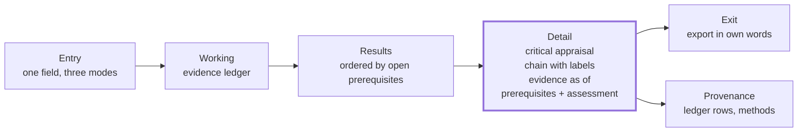

# Counterpoint — PRD (superseded by `PRD Elute.md`, kept for the decision history)

**Working name:** Counterpoint (a repurposing tool that always shows you the counterpoint)
**Track:** HackMIT 2026 · Regeneron Challenge ("Help Patients: Make Clinical Trials and Biostatistics Better")
**Date:** September 19, 2026 · **Status:** v1, pre-build
**Source vision:** [`user_journey.txt`](./user_journey.txt) — this document does not restate it; it decides what to do with it.

---

## 1. One line

Build the tool that turns a skeptical scientist's *"prove it to me"* into *"now I can decide for myself"* — by always showing the reasoning, always showing the doubt, and never pretending to be more certain than it is.

---

## 2. The problem, as it actually happened

In July 2016, a Georgetown group published a pilot study of **nilotinib** — a leukemia drug — in twelve people with Parkinson's disease. Motor and cognitive scores improved. A dopamine metabolite rose in spinal fluid. The press coverage was enormous. ([Pagan et al., *J Parkinsons Dis* 2016](https://doi.org/10.3233/jpd-160867))

Imagine a translational scientist at a pharma company reading it that week. Their job is to decide whether this is worth pursuing. Their reputation rides on the call. What could they see, and what couldn't they?

What was *knowable* at the time, from public sources, before a single patient enrolled in the follow-up trial:

- **The pilot was open-label with no placebo arm** — the authors said so themselves. Twelve patients, all of whom knew they were on the drug.
- **Nilotinib barely enters the brain.** Two years earlier, a leukemia study had measured the CSF/plasma ratio at **0.53% (range 0.23–1.5%)**. ([Reinwald et al., *BioMed Res Int* 2014](https://pmc.ncbi.nlm.nih.gov/articles/PMC4082894/))
- **The biomarker had an alternative explanation.** Five months after the pilot, a peer commentary argued the dopamine-metabolite rise could be explained by patients being taken off their MAO-B inhibitors for the study — not by nilotinib at all. ([Schwarzschild, *J Parkinsons Dis* 2017; online Dec 2016](https://pmc.ncbi.nlm.nih.gov/articles/PMC5302030/))

The properly controlled trial — **NILO-PD**, 76 patients, 25 sites, double-blind, placebo-controlled — recruited from November 2017 to December 2018. It found no robust clinical effect, no change in the dopamine biomarkers, and CSF concentrations of a fraction of a percent of serum. ([Simuni et al., *JAMA Neurology* 2021](https://jamanetwork.com/journals/jamaneurology/fullarticle/2773698); [PK abstract](https://www.neurology.org/doi/10.1212/WNL.94.15_supplement.4418)) The Parkinson's Foundation's summary: people with Parkinson's [should pass on this drug](https://www.parkinson.org/blog/research/nilotinib).

Every counter-argument was public before the trial started. None of it was *organized*. That is the bottleneck.

**The problem is not generating repurposing hypotheses.** AI now produces them by the hundred. The problem is that the accountable human can't see *why* a candidate is believed, *what would make it wrong*, or whether it rests on decades of evidence or one unblinded pilot. So the good hypotheses die in an inbox next to the bad ones, and the bad ones sometimes get a phase 2.

The person who wrote this challenge said it to us directly:

> *"It's not that I don't believe you. I don't understand what your rationale is."* — Henry Wei, MD, Regeneron, Sept 19, 2026

### The numbers behind it

- When Amgen scientists tried to reproduce 53 landmark preclinical cancer papers, they succeeded with **6**. ([Begley & Ellis, *Nature* 2012](https://www.nature.com/articles/483531a)) Bayer reported reproducing roughly **20–25%** of 67 published findings. (Prinz et al., *Nat Rev Drug Discov* 2011, [doi:10.1038/nrd3439-c1](https://doi.org/10.1038/nrd3439-c1))
- Regeneron's own origin story is a replication failure: published knockout-mouse phenotypes that didn't hold up when the company made the mice itself. The starter kit calls the resulting discipline *separating what people believe from what they actually know*. ([Regeneron starter sheet: scientific credibility of sources](./STARTER%20SHEETS%20from%20Regeneron/); Henry Wei, in conversation)
- A new chemical entity takes **13–15 years and $2–3B**; repurposing an approved drug can succeed at up to ~30% versus under 10% for de novo discovery — *if* the right candidates are chosen. ([Pushpakom et al., *Nat Rev Drug Discov* 2019](https://www.nature.com/articles/nrd.2018.168))
- It keeps happening. Exenatide: positive phase 2 in 2017 ([Athauda et al., *Lancet*](https://pubmed.ncbi.nlm.nih.gov/28781108/)), negative phase 3 in 2025, 194 patients, 96 weeks ([Vijiaratnam et al., *Lancet*](https://pubmed.ncbi.nlm.nih.gov/39919773/)).

---

## 3. The claim — stated so it can be false

> **A domain expert who has never seen the tool, shown the Detail view for one candidate, can within two minutes and without being told what to decide (a) state the strongest argument against the candidate and (b) name its weakest evidentiary link.**

**How we'll test it before submission.** Three people who did not build the UI (a mentor, a bio grad student, a teammate from the backend track). Nilotinib case. Timer starts when the Detail view loads. We record their answers verbatim. Pass = at least 2 of 3 succeed on *both* (a) and (b). **We report the result in the README either way**, including verbatim answers, including if it fails.

Why this claim and not "scientists trust it": trust is unmeasurable in a weekend, and a tool can earn trust by being persuasive rather than by being right. The TxGNN team's own user study found explanations raised expert confidence by 49%. ([Huang et al., *Nat Med* 2024](https://www.nature.com/articles/s41591-024-03233-x)) Confidence is not the same as being right. We don't want to raise confidence. We want to raise the *quality of the objection*.

---

## 4. Who it's for

**Primary — the accountable expert.** A translational scientist or physician-scientist in pharma. Deep domain expertise; time-poor; skeptical of AI by default; professionally on the hook for being wrong; not a command-line user. Knows more biology than the model. Doesn't want to be told what to believe — wants their own judgment amplified. (Full persona in `user_journey.txt`. Note: the judge of this challenge *is* this person.)

**Secondary — the IT/security reviewer.** Wants to see what the agent actually called, what packages it depends on, and whether anything is inappropriate for an enterprise environment. Henry raised this unprompted.

**Job stories** (Intercom form — situation, motivation, outcome):

- *When* I'm handed an AI-generated repurposing candidate, *I want to* see why it might be wrong before why it might be right, *so I can* defend or kill it to a colleague in my own words.
- *When* a mechanistic chain has six links, *I want to* know which link is established and which is one mouse paper, *so I* don't stake a program on the weak one.
- *When* a drug looks efficacious, *I want* safety to be part of the argument, not a banner, *so I* see *why* it's downranked, not just that it was.
- *When* IT asks what this thing does, *I want to* show them the raw tool calls, *so* the tool doesn't get blocked at procurement.

---

## 5. What we heard (discovery)

**Interview 1 — Henry Wei, MD (Regeneron; ex-Google, Aetna, White House; Cornell Med faculty). Sept 19, 2026, in person, ~25 min.** Verbatim or near-verbatim:

- On the trust gap: *"It's not that I don't believe you. I don't understand what your rationale is."*
- On the design principle: *"Assume that you've done this wrong. Try and defend what it is that you're coming up with."* — and that this is "proving to be hard" because chain-of-thought tokens are "not how scientists think... I have some prior knowledge of how that graph of knowledge or mechanisms work. So being able to map to that."
- On epistemic status: Regeneron "made a living off of... separating out what people believe versus what they actually know." The knockout-mouse story. *"It's been published. That doesn't mean it's actually... it's not that they're lying, but they might have not been able to replicate it."*
- On safety: "you don't just randomly give drugs that seem to light up in a petri dish"; a repurposed drug that "hits the liver" in a patient whose "liver is so shot" — safety is a *reason*, scanned the way a drug developer scans.
- On scope: repurposing is allowed ("doesn't preclude you"); neurodegenerative and rare disease are where "repositioning" classically lives; metformin "repeatedly comes up."
- On packaging: "the skill sets of folks to go and run command line agents is still limited"; "putting it into some type of user interface so that everyone can get to it"; "the IT department will often want to [see the backend]."
- On the tightrope: real-world off-label use is signal, but "some drug companies were very irresponsible and basically marketed an unapproved indication" — this tool must never read as promotion.
- On the risk: discovery-side projects need a judge other than him on Sunday.

**Interviews 2–3 — TODO.** Targets: one more mentor or clinician at the venue; one bio/pharmacology grad student. Ask them to read the nilotinib pilot abstract and say what they'd want to know. Record verbatim.

---

## 6. Why not existing tools

| Tool | What it does | What it doesn't |
|---|---|---|
| **TxGNN Explorer** (Harvard, [*Nat Med* 2024](https://www.nature.com/articles/s41591-024-03233-x)) | Ranks candidates; shows sparse multi-hop paths *for* each prediction; panels: control, edge-threshold, drug embedding, path explanation. 12-expert study: 8/12 wouldn't rely on predictions *without* explanations. | Shows only the case *for*. No counter-case. No per-link epistemic status. No safety-as-argument. No trial framing. |
| **TxAgent** (Harvard, [arXiv 2025](https://arxiv.org/abs/2503.10970)) | Reasoning agent over ToolUniverse's 211 tools; emits step-by-step traces. | Traces are tokens, not a walkable chain (Henry's point). Doesn't argue against itself. |
| **Every Cure / MATRIX** ([ARPA-H, $48.3M, 2024](https://arpa-h.gov/news-and-events/arpa-h-awards-ai-driven-project-repurpose-approved-medications)) | All-drugs × all-diseases efficacy heatmap; open-source platform planned. | A score. The "why" and "why not" live with the humans downstream. |
| **Healx** ([healx.ai](https://healx.ai)) | Commercial AI repurposing for rare disease; HLX-1502 in phase 2 for NF1 (2025). | Proprietary; the reasoning is the product they sell, not the product they show. |
| **BenevolentAI** ([baricitinib for COVID-19](https://www.benevolent.com/about-us/publications/expert-augmented-computational-drug-repurposing-identified-baricitinib-treatment-covid-19/)) | Knowledge-graph repurposing, "expert-augmented." | Same: expert judgment happens *around* the tool, not *in* it. |
| **Broad Drug Repurposing Hub** ([7,423 compounds](https://www.broadinstitute.org/developing-diagnostics-and-treatments/drug-repurposing-hub)) · **ReDO_DB** ([268 non-cancer drugs with anticancer evidence](https://pmc.ncbi.nlm.nih.gov/articles/PMC4096030/)) | Curated libraries and literature databases. | Inputs, not decisions. |

**Positioning in one line:** *They optimize the ranking. We optimize the decision.*

The concrete thing none of them does: put the strongest argument *against* a candidate on screen before the argument for it, and label every link in the chain as **established / contested / single-source** so the weak link is visible without hunting.

---

## 7. The story we'll demo (≈2 minutes)

1. **Entry.** One sentence: *"Approved drugs that might treat something else — and the strongest case against each one."* One field. It accepts a drug, a condition, or a drug–condition pair, and three example chips underneath teach the three modes by example rather than by label. We type **Parkinson's disease**. (A second entry, shown as a tab: paste a PMID, DOI, or abstract — the §2 moment — and the tool shows what it extracted, including the study *design*, before anything runs. A wrong read is caught in two seconds, not after the appraisal.)
2. **Working.** Not a spinner and not a progress bar: an **evidence ledger** that builds in front of the user, one line per step, each naming its source and what came back. Ten steps — resolve the query (Open Targets, MONDO); disease → targets with genetic evidence (Open Targets Platform); targets → approved drugs (ChEMBL); mechanism paths ≤ 4 hops (PrimeKG, Reactome); registered trials with blinding and n extracted (ClinicalTrials.gov API v2); literature with study design classified (PubMed, Europe PMC); CNS exposure (published CSF/plasma ratios, P-gp status); safety in the likely population (openFDA labels, FAERS); objections, each of which must cite a ledger line or is discarded; confidence drivers. Honest duration with live sources: 40–90 seconds. Finished steps open immediately — the target list from step 2 is readable while step 6 runs. The ledger never disappears; it is the citation index for everything that follows.
3. **Results.** An ordered list — ordered by *fewest unresolved prerequisites*, not by a score, and the header says so. Each card carries name, class, and approved indication; a mechanism one-liner; a best-evidence badge with design, outcome, and n; the weakest link in one line; a four-segment driver bar (mechanism, clinical, exposure, safety); a safety chip only when a boxed warning exists; and a source count. **Ambroxol** is first (GCase chaperone; GBA1-stratified phase 3 ASPro-PD enrolling, outcome unknown — [protocol, *J Neurol* 2026](https://pubmed.ncbi.nlm.nih.gov/41708985/)). **Nilotinib** is fourth — and the card already says why. Two alternate views are one click away: an **evidence board** (columns are the most decisive study that exists; it shows five of six Parkinson's candidates have already failed a controlled study) and a **mechanism × clinical signal** scatter (nilotinib sits in the "strong biology, failed in people" quadrant).
4. **Detail — Critical appraisal.** We open nilotinib. The first section is **Critical appraisal**: the strongest objections, ordered by consequence, each citing a ledger line. Brain exposure at tolerated doses is very low (CSF/plasma 0.53 %, 2014). The efficacy signal is uncontrolled (open-label, n = 12, 2016). The biomarker has an alternative explanation (MAO-B withdrawal, Dec 2016). And, as of today, the controlled trial was negative (NILO-PD, 2020). Below it, the **mechanism chain** — *nilotinib → ABL1 → c-Abl active in PD brain → α-synuclein clearance → CNS exposure → clinical benefit* — each link one claim, each labeled **established / contested / single-source / refuted / unknown**. Selecting a link shows who says so, the study design and n, what argues against it, and a plain-language *why this label*. The CNS-exposure link is contested and is visibly the weakest.
5. **The aha — Evidence as of.** A three-position control at the top of the page: *Jul 2016 · Nov 2017 · Today*. At Jul 2016, the MAO-B objection is not yet published and the clinical link is single-source. At Nov 2017 — the day NILO-PD enrolled its first patient — two objections and a peer critique are already on screen. At Today, the clinical link reads *refuted*. One line under the header states what the user is looking at: *"evidence frozen at 20 Nov 2017 — the day NILO-PD enrolled its first patient."* That is the backtest as an interaction.
6. **Trial prerequisites, then the decision.** Five conditions with a status each: target engagement shown in the human brain (not shown); effect observed under blinding (no); independent replication of the human signal (none); biomarker validated against an alternative (contested); safety acceptable in the intended population (with monitoring — the boxed QT warning, explained in terms of an older, polypharmacy Parkinson's population and what it does to the trial you would have to run). Then **Your assessment**: pursue / needs specific data / deprioritise, plus one line in the scientist's own words. That line is what exports.
7. **Second path, 15 seconds.** The same field → **metformin** → plausible for several conditions and weak for all of them; the 2025 PD pilot ([n = 60, no UPDRS difference](https://www.frontiersin.org/journals/pharmacology/articles/10.3389/fphar.2025.1497261/full)) is on the card, labeled.
8. **Provenance.** Click any ledger citation: the row expands to the tool called, the query, records returned, the timestamp, and the extracted value with whether a human verified it. An auto-generated **Methods** section and a dependency manifest sit beside it — for the IT reviewer, and for anyone who wants to reproduce the appraisal.

The moment we're designing for: a judge moves *Evidence as of* to Nov 2017, reads the appraisal, and says *"they could have seen this."*

---

## 8. What it does (the six moments)

Inherited from `user_journey.txt`; redesigned after review. Each moment states what it is and why it is that way.

- **Entry — "I understand what this does in five seconds."** One sentence. One field that accepts a drug, a condition, or a pair; three example chips teach the modes. *Why not two buttons:* a fork forces a taxonomy decision before the user has expressed intent; both paths produce the same object; and it has no room for the most common real job — being handed a specific candidate and asked whether it is credible. A worked appraisal below the fold shows the tool's character (it leads with objections) before the user types. A paste-a-paper tab covers the moment the §2 story is about.
- **Working — "I can see what it consulted."** The evidence ledger: ten steps, each naming its real source (Open Targets, ChEMBL, PrimeKG/Reactome, ClinicalTrials.gov, PubMed/Europe PMC, published PK, openFDA/FAERS) and what came back. Finished steps open while later ones run. The stated duration is the real one — 40–90 s with live sources. The ledger is the citation index for every downstream claim, which is why it is designed as a ledger and not a progress bar.
- **Results — "I can triage this in fifteen seconds, and I can see why the order is what it is."** An ordered list is the default because triage needs scan order — but the order is *fewest unresolved prerequisites*, never a score, and the header says so. Two alternate views (evidence board; mechanism × clinical signal) answer the question a list hides: *did the biology translate?*
- **Detail — "I can defend or kill this myself."** Critical appraisal first. Mechanism chain with an epistemic label on every link and a *why this label* rule. Safety as a reason, explained for the likely trial population. Trial prerequisites with a status each. The scientist's own assessment, captured in their words. *Evidence as of* freezes the page at a date.
- **Provenance — "I can see exactly what it did."** Replaces "depth on demand." Not a toggle and not a debug pane: every claim carries a ledger citation; a ledger row expands to tool, query, records, timestamp, extracted value, and verification status. An auto-generated Methods section and a dependency manifest serve the IT reviewer.
- **Exit — "I can take this with me."** Export the appraisal: objections, the chain with its labels, prerequisites, and the scientist's own assessment line — the argument survives outside the tool.

### The results card — every element and why it is there

| Element | Why it is on the card |
|---|---|
| Rank number, monospace | Scan order for triage; set small so it recedes. |
| Name, class, approved indication | The approved indication signals a known safety profile — the premise of repurposing. |
| Mechanism one-liner (*target → effect*) | Scientists parse this faster than a prose "why." |
| Best-evidence badge — design · outcome · n — with a status dot | The single most important triage signal. Design and n are what a scientist checks first. |
| Weakest link, one line | Principle 4 at card level: the user never opens a card to discover the catch. |
| Driver bar — mechanism, clinical, exposure, safety, three pips each | Replaces a bare confidence number (the brief's first anti-pattern). Shows what set the rank; a refuted clinical segment is red so the eye lands on it. |
| Safety chip, only when a boxed warning exists, with the reason | Safety as a reason, not a banner. Absent when there is nothing to say. |
| Source and trial count | Grounding, and a cue to how much sits behind the card. |
| *Not on the card:* a confidence number; the case-for prose; the full chain | The number is the anti-pattern; the rest belongs in Detail. |

### The epistemic labels — why four, not two

**Established** (reproduced by independent groups or accepted by a regulator), **contested** (evidence on both sides), **single-source** (one study, one group, not replicated), **unknown** (no evidence either way), and **refuted** once a controlled study has tested the claim directly. Two labels — verified/contested — are not enough: contested and single-source are different failure modes with different remedies, and *unknown* is an honest state, not a gap. A chain is only as strong as its weakest link; the labels let the eye go there in one second. Every label carries a one-sentence *why this label* so the rule is inspectable, and every label links to its sources so the user can disagree.

**The three principles that *are* the product** (the other four are hygiene):
1. Never a conclusion without its reasoning *and* its doubt.
2. Known vs. believed — labeled, on every claim, always.
3. Lead with the weakness. The counter-case is a gift, not a disclaimer.

---

## 9. Appetite and the cut

**Appetite:** the remainder of the hackathon window (submission Sunday, Sept 20). Fixed time, variable scope. If we ship one screen, it's Detail.

| | What | Why |
|---|---|---|
| **Must** | Entry → Results (ordered list) → Detail for the Parkinson's hero case: critical appraisal, mechanism chain with epistemic labels and *why this label*, driver bars, safety-as-reason, trial prerequisites, the scientist's assessment | This *is* the claim in §3. Everything else is context for it. |
| **Must** | *Evidence as of* on Detail (Jul 2016 · Nov 2017 · Today) | The backtest as an interaction; the demo's aha; nothing in the landscape has it. |
| **Must** | Curated-data statement on every screen, with a plain sentence on what real data (e.g., All of Us) this would run on | Honesty is a trust signal for this user; hiding it is the anti-pattern. |
| **Must** | The four hero candidates hand-curated with dated, linked sources (nilotinib, exenatide, ambroxol, metformin); isradipine and simvastatin source-checked before they appear | The backtest in §12 depends on them. Curated beats generated for a story that must be *right*. |
| **Should** | The evidence ledger during the wait, with finished steps openable | Pre-loads trust and doubles as the citation index. A scripted sequence with real source names is acceptable if the backend can't stream. |
| **Should** | Provenance: expandable ledger rows (tool, query, records, timestamp, verification) and an auto-generated Methods section | Henry asked for the backend to be visible for IT; a citation system is the honest form of that, and a raw-JSON toggle is not. |
| **Should** | Export / copy-as-document, including the assessment line in the scientist's words | The rubric wants the argument to survive outside the tool. |
| **Should** | Alternate results views (evidence board; mechanism × clinical signal) | Same data as the list; cheap; the scatter is the thesis as a picture. First to cut if time is short. |
| **Should** | Paste-a-paper entry tab with extraction preview | The §2 moment; the extraction preview is a trust move in itself. |
| **Won't** | Literature-integrity scoring beyond a clearly labeled heuristic | Needs a real signal (replication data, retraction status). A fake score is worse than an honest label. |
| **Won't** | Multiple ML backends | One real path plus curated fixtures is honest and shippable. Four is a weekend of environment setup. |
| **Won't** | Real-world-data / off-label prescribing analysis | Henry's tightrope. Without governed data it reads as promotion. |
| **Won't** | Anything that outputs a recommendation to prescribe or pursue | Principle 7. The tool organizes and challenges; it never overrides. |

---

## 10. Risks

Using Cagan's four: **value** (will they use it), **usability** (can they figure it out), **feasibility** (can we build it), **viability** (does it work in the world).

| Risk | Which | Severity | Mitigation |
|---|---|---|---|
| Live backend (any of TxGNN / TxAgent / ToolUniverse) doesn't run end-to-end in time | Feasibility | **Kills us** | Hour-one spike on the single most installable backend. Curated fixtures for the hero case are built *first* and are the demo's spine regardless. The banner says which mode is live. |
| Epistemic labels have no principled source | Feasibility → Value | High | For the hero case: hand-labeled from dated primary sources (this doc). For generated candidates: a stated heuristic (study design, n, replication, blinding) with the heuristic *shown* in the UI. Never a bare label. |
| Discovery-side project needs a non-Henry judge on Sunday | Viability | Medium | Frame the closing question as trial planning; cite the three starter sheets we align with (Agentic Clinical AI Platform, Neurosymbolic/PrimeKG, Scientific Credibility). Tell Henry early so he can route it. |
| "Repurposing" reads as off-challenge to a trials-focused judge | Viability | Medium | Section 2 of this doc is the answer: the cost is *trials that shouldn't have run*. NILO-PD is a trial. |
| Hindsight bias — we chose a case whose outcome we know | Value | Medium | Every counter-argument is dated before NILO-PD enrollment; the tool must derive them from sources, not the outcome. And we show ambroxol — a candidate whose phase 3 is still running — with the same treatment. |
| The UI makes doubt look like weakness rather than rigor | Usability | Medium | Counter-case is designed as the *first* and most polished element, not a disclaimer box. Test with the §3 protocol. |
| Value is real but nobody can install it Monday | Viability | Low for the weekend, high after | MIT license, one-command setup, fixture mode that runs with zero keys. |

---

## 11. What this is not

- **Not a medical device, not a clinical decision tool, not a prescribing aid.** It organizes evidence for a scientist who is qualified to weigh it. The UI says so.
- **Not validated.** The working data is curated and partly synthetic. Every screen says so and says what real data this would run on in production.
- **Not promotion.** It never recommends pursuing or prescribing anything. It never presents off-label use as endorsement. Conclusions are at the drug-class or mechanism level wherever possible.
- **"Cannot determine" is a valid and valuable output.** When the evidence doesn't support a label, the label is *unknown*, shown as such. (Borrowed from Regeneron's AECausality starter sheet.)
- **We say which way it errs.** By design, this tool errs toward *doubt*: it will underrate some good candidates. We consider that the right failure direction for a decision-support tool whose users are accountable for false positives.

---

## 12. Exams (Heilmeier: "how will we know?")

One observable moment per rubric criterion, plus the backtest.

| Criterion | The exam |
|---|---|
| **Readiness** | A judge clones the repo and runs one command; the Parkinson's demo loads in fixture mode with no API keys. MIT license in the root. |
| **Utility** | A judge, unprompted, says something like *"I'd have killed that one"* on the nilotinib Detail view. |
| **Design** | The §3 test passes: 2 of 3 naive experts state the counter-case and the weakest link within two minutes. Result in the README, pass or fail. |
| **Relevance** | The hero case is Parkinson's — a disease named on [Regeneron's neuroscience page](https://www.regeneron.com/science/research-development/neuroscience) (Alnylam collaboration: ALS, Huntington's, tauopathies, Parkinson's). |
| **Packaging** | This PRD, a README, a 10–12 slide deck, and a demo video are all public links before submission. |
| **The backtest** | With *Evidence as of* set to Nov 2017, the nilotinib Critical appraisal shows all three pre-trial objections (open-label n = 12; CSF ratio 0.53 %; MAO-B withdrawal), each linked to its source — and none of the post-trial ones. Set to Jul 2016, the MAO-B objection is absent. |

---

## 13. FAQ — the hard questions

**Isn't this just an LLM wrapper?**
The model layer is not the product and we don't claim it is. The product is the *contract* on what a conclusion must arrive with — reasoning, doubt, and calibrated confidence — and an interface that makes a scientist's own judgment faster. A wrapper adds convenience. This adds a discipline the underlying tools don't have (see §6).

**Who labels a claim "established" vs. "contested," and what happens when the labeler is wrong?**
For the hero case: we do, by hand, from dated primary sources, and every label links to them so you can disagree. For generated candidates: a stated heuristic (study design, sample size, blinding, independent replication) whose inputs are shown next to the label. The label is never bare. If the labeler is wrong, the source is one click away — that's the whole point of walkable reasoning. And "unknown" is always an allowed label.

**Which direction does it err?**
Toward doubt. It will sometimes underrate a good candidate. We chose that deliberately: this user is accountable for false positives, and the cost of a wrongly-run trial (§2) dwarfs the cost of a second look.

**Why should anyone believe a demo on curated and synthetic data?**
They shouldn't believe the *results*. They should evaluate the *behavior*: does the tool surface the counter-case, label the weak link, and stay honest about what it doesn't know? The nilotinib backtest is real, dated, and sourced — that part isn't synthetic. The banner on every screen says which parts are.

**Is this off-label promotion?**
No, and it's designed not to be. It never recommends pursuing or prescribing; it presents evidence and counter-evidence for a qualified scientist. It doesn't mine real-world prescribing data (§9, Won't). Language throughout is "here's the case and the case against — you decide."

**Why not just use TxGNN Explorer?**
Use it — it's excellent at ranking and at showing paths *for* a prediction. It doesn't show the case against, doesn't label evidence status per link, and doesn't treat safety as an argument. Its own user study measured how much explanations raised confidence in *correct* predictions. We're asking the other question: can you find the flaw?

**This is a clinical-trials challenge. Repurposing is discovery. Why here?**
Because the failure mode of bad repurposing is a *trial that shouldn't have run*. NILO-PD was 76 patients, 25 sites, and roughly two years. Exenatide-PD3 was 194 patients and 96 weeks. The output of this tool is a trial-prerequisites checklist — which conditions a trial would have to assume, and which of them are unmet — that's trial planning.

**You picked a case where you already know the ending. Isn't that cheating?**
It's a backtest, and we hold it to a backtest's rule: every counter-argument must be dated before the trial enrolled and derived from sources, not from the outcome. We also show ambroxol — a candidate whose phase 3 is still running — with identical treatment. If the tool only works in hindsight, that will be visible.

**What don't you know yet?**
Whether any live backend runs end-to-end by Sunday. Whether the §3 test passes. Whether a Sunday judge will weight discovery-side work. All three are in §10 with mitigations, and all three will be reported honestly.

---

## 14. Decision log

| Decision | Chosen | Why |
|---|---|---|
| Stay with repurposing vs. pivot to a trials use case | **Stay** | Henry explicitly allowed it, named the tools himself, and gave us two of our principles. Three starter sheets align. The trial-planning framing (§7 step 5) closes the gap. |
| Hero disease | **Parkinson's** | Neurodegenerative repositioning is where Henry said it lives; on Regeneron's stated neuroscience list; nilotinib gives a dated, sourced backtest. |
| Hero candidate | **Nilotinib** (with ambroxol as the live-outcome control) | All three counter-arguments were public before the trial — the strongest possible illustration of the trust gap. |
| Secondary path | **Metformin, drug-first** | Henry's own example; every judge knows it; a 2025 PD pilot gives a clean "plausible but weak" case. |
| Objections placement | **First section of Detail, above the fold** | Principle 4. The differentiator vs. TxGNN Explorer. |
| Objections section name | **"Critical appraisal"** (was "Assume this is wrong") | The term of art in evidence-based medicine; neutral and recognizable to a physician-scientist. The original wording read as negative rather than rigorous. |
| Closing question | **"Trial prerequisites" + "Your assessment"** (was "Worth a trial? What would kill it?") | Gives the scientist the data points a go/no-go needs, in a checklist they already use, and captures their decision in their own words. The tool supplies inputs; it does not pose the question rhetorically. |
| Entry | **One field, three modes; paste-a-paper tab** (was two buttons) | Two buttons force a taxonomy choice, fork to the same object, and omit pair evaluation — the most common real job. |
| Wait state | **Evidence ledger with real sources; honest 40–90 s** (was "10 seconds of visible rigor") | Step names must be real to be credible; finished steps open immediately; the ledger becomes the citation index. |
| Results default | **Ordered list by unresolved prerequisites; evidence board and scatter as alternates** | Scan order for triage; the order is legible and not a score; the alternates answer "did the biology translate?" |
| Epistemic labels | **Established / contested / single-source / unknown, plus refuted** (not verified/contested) | Contested and single-source are different failure modes; unknown is an honest state. Each label carries a *why this label*. |
| Agent's work | **Provenance ledger and Methods section** (was a "show the agent's work" toggle) | A toggle frames it as debug output; a citation system frames it as scholarship, which is what the IT reviewer and the scientist both need. |
| The aha | **Evidence as of** (three dates on Detail) | Turns the backtest from a claim in a deck into an interaction a judge performs. |
| Data strategy | **Curated fixtures first; live backend if it lands** | Readiness criterion punishes a demo that doesn't run; the story must be *right* more than it must be *generated*. |
| Confidence display | **Driver bar, four named segments; never a single number** | A bare number is the #1 anti-pattern in the brief; the bar shows what set the rank. |
| Literature-integrity scoring | **Deferred** | No principled signal in a weekend; a fake score would violate the product's own philosophy. |
| Stack, backend, schema | **Not in this document** | Next document. This one is about the problem, the person, the story, and the cut. |

---

## 15. Deliverables

- Public GitHub repo, **MIT license**, one-command run, fixture mode with no keys
- `README.md` with setup, the §3 test result (verbatim), and what's synthetic
- This `PRD.md`, published as a public link
- Demo video (≤3 min) following §7
- Slide deck, 10–12 slides, mapped to the five rubric criteria
- Starter-sheet alignment noted in the deck: *Agentic Clinical AI Platform*, *Structural & Neurosymbolic AI*, *Scientific credibility of sources*, *AECausality* (for the "cannot determine" and error-direction principles)

---

## Sources

**Hero case**
- Pagan F, et al. Nilotinib effects in Parkinson's disease and dementia with Lewy bodies. *J Parkinsons Dis* 2016. https://doi.org/10.3233/jpd-160867
- Reinwald M, et al. Efficacy and pharmacologic data of nilotinib in BCR-ABL+ leukemia with CNS relapse. *BioMed Res Int* 2014. https://pmc.ncbi.nlm.nih.gov/articles/PMC4082894/
- Schwarzschild MA. Could MAO-B inhibitor withdrawal rather than nilotinib benefit explain the dopamine metabolite increase? *J Parkinsons Dis* 2017;7:79–80 (online Dec 2016). https://pmc.ncbi.nlm.nih.gov/articles/PMC5302030/
- Simuni T, et al. Efficacy of nilotinib in patients with moderately advanced Parkinson disease (NILO-PD). *JAMA Neurol* 2021. https://jamanetwork.com/journals/jamaneurology/fullarticle/2773698
- NILO-PD pharmacokinetics abstract. *Neurology* 2020. https://www.neurology.org/doi/10.1212/WNL.94.15_supplement.4418
- Parkinson's Foundation summary. https://www.parkinson.org/blog/research/nilotinib
- Athauda D, et al. Exenatide once weekly vs placebo in Parkinson's disease. *Lancet* 2017. https://pubmed.ncbi.nlm.nih.gov/28781108/
- Vijiaratnam N, et al. Exenatide-PD3. *Lancet* 2025. https://pubmed.ncbi.nlm.nih.gov/39919773/
- ASPro-PD protocol (ambroxol, phase 3). *J Neurol* 2026. https://pubmed.ncbi.nlm.nih.gov/41708985/ · Parkinson's UK: https://www.parkinsons.org.uk/news/2025/phase-3-trial-ambroxol-underway
- Metformin in PD, randomized pilot. *Front Pharmacol* 2025. https://www.frontiersin.org/journals/pharmacology/articles/10.3389/fphar.2025.1497261/full

**Problem numbers**
- Begley CG, Ellis LM. Raise standards for preclinical cancer research. *Nature* 2012. https://www.nature.com/articles/483531a
- Prinz F, et al. Believe it or not. *Nat Rev Drug Discov* 2011. https://doi.org/10.1038/nrd3439-c1
- Pushpakom S, et al. Drug repurposing: progress, challenges and recommendations. *Nat Rev Drug Discov* 2019. https://www.nature.com/articles/nrd.2018.168

**Landscape**
- Huang K, et al. A foundation model for clinician-centered drug repurposing (TxGNN). *Nat Med* 2024. https://www.nature.com/articles/s41591-024-03233-x
- Gao S, et al. TxAgent. arXiv 2025. https://arxiv.org/abs/2503.10970
- ARPA-H / Every Cure MATRIX. https://arpa-h.gov/news-and-events/arpa-h-awards-ai-driven-project-repurpose-approved-medications
- Healx. https://healx.ai · BenevolentAI baricitinib. https://www.benevolent.com/about-us/publications/expert-augmented-computational-drug-repurposing-identified-baricitinib-treatment-covid-19/
- Broad Drug Repurposing Hub. https://www.broadinstitute.org/developing-diagnostics-and-treatments/drug-repurposing-hub · ReDO project. https://pmc.ncbi.nlm.nih.gov/articles/PMC4096030/

**Regeneron**
- Neuroscience R&D. https://www.regeneron.com/science/research-development/neuroscience · Pipeline. https://www.regeneron.com/science/investigational-pipeline
- Challenge overview, judging rubric, and starter sheets: `./STARTER SHEETS from Regeneron/`
- Henry Wei, MD — mentoring conversation, HackMIT, Sept 19, 2026 (transcript held by the team)
